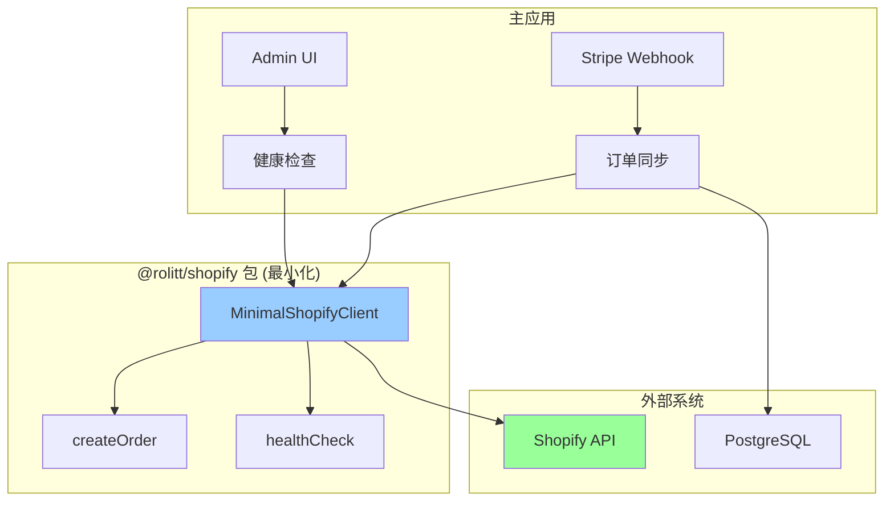

# Shopify 集成重构设计文档 - 最小化方案

## 🎯 商业价值驱动的设计原则

1. **Less is More**：只保留核心业务功能
2. **零技术分裂**：向后兼容，渐进式迁移
3. **即插即用**：可选择性启用功能
4. **商业价值优先**：每个组件都有明确的商业回报

## 🏗️ 最小化架构

### 简化系统架构图



### 核心设计原则

1. **单一客户端**：只有一个 MinimalShopifyClient
2. **核心功能**：只实现订单同步和健康检查
3. **向后兼容**：保持现有 API 不变
4. **可选启用**：通过配置开关控制功能

## 🔧 最小化组件设计

### 1. MinimalShopifyClient - 核心商业价值

**商业价值**：消除代码重复，降低维护成本

```typescript
class MinimalShopifyClient {
  // 核心功能：订单同步（支撑收入）
  async createOrder(orderData: any): Promise<{success: boolean, data?: any, error?: string}>;
  
  // 运维必需：健康检查
  async healthCheck(): Promise<{success: boolean, data?: any, error?: string}>;
  
  // 向后兼容：保持现有 API
  async request(method: string, path: string, data?: any): Promise<any>;
}
```

**设计原则**：
- 只保留有直接商业价值的功能
- 向后兼容，零技术分裂
- 可选择性启用

## 🚀 实施策略 - 最小化迁移

### 第一步：替换客户端（1天）
1. 用 `MinimalShopifyClient` 替换 `src/libs/shopify/core/client.ts`
2. 保持所有现有 API 不变
3. 删除 `src/libs/shopify/` 目录

### 第二步：验证功能（0.5天）
1. 测试订单同步功能
2. 验证健康检查端点
3. 确认 Admin UI 正常工作

### 第三步：清理代码（0.5天）
1. 更新导入语句
2. 移除未使用的代码
3. 更新文档

## � 商据业价值验收标准

### 成功指标
- [ ] 代码重复率从 100% 降到 0%
- [ ] Shopify 相关 bug 修复时间减少 50%
- [ ] 新功能开发速度提升 30%
- [ ] 订单同步成功率保持 99.9%

### 技术指标
- [ ] 只有一个 MinimalShopifyClient 实例
- [ ] 所有现有 API 保持兼容
- [ ] 健康检查正常工作
- [ ] 订单同步功能正常

这个最小化设计确保我们专注于核心商业价值，避免过度工程化。