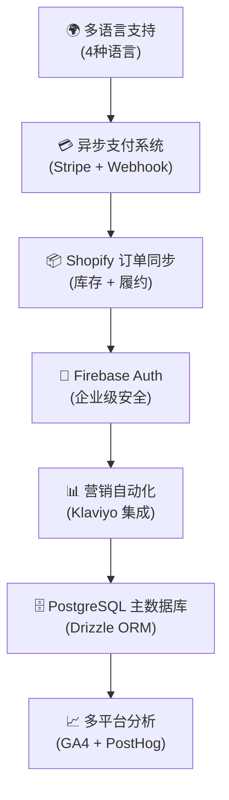
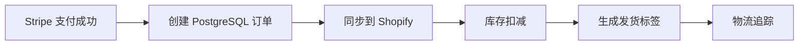

# 🤖 Claude Code 开发指导文档

> **Rolitt AI 伴侣产品官方网站 - Claude Code 专用开发蓝图**
>
> 采用"从上到下"工作流程，通过 ROADMAP → Tasks → One-Shotting 执行模式，提升 AI 编码效率 20-30%

---

## 📋 目录

- [🎯 核心理念](#-核心理念)
- [🏗️ 项目架构概览](#️-项目架构概览)
- [📊 ROADMAP 使用指南](#-roadmap-使用指南)
- [⚡ Tasks 原子化执行](#-tasks-原子化执行)
- [🚀 One-Shotting 最佳实践](#-one-shotting-最佳实践)
- [🔧 项目特定指导](#-项目特定指导)
- [📚 开发规范与工具](#-开发规范与工具)

---

## 🎯 核心理念

### 为什么采用"从上到下"思路？

**传统问题**：
- AI 在长会话中容易丢失上下文（token 限制）
- "边做边想"导致架构不一致
- 缺乏结构化指导容易偏题

**解决方案**：
1. **🗺️ 高层规划**：先构建清晰蓝图（ROADMAP + Tasks）
2. **⚡ 原子执行**：AI 基于蓝图执行 5-8 步原子任务
3. **🔄 迭代优化**：规划可迭代，但结构化程度高

### 💡 核心洞察

- **AI 擅长**：执行明确定义的原子化任务
- **人类提供**：结构化指导和架构决策
- **协作模式**：人类规划 + AI 执行 + 人类审查

---

## 🏗️ 项目架构概览

### 🎯 Rolitt 项目特点



### 🏛️ 技术栈核心

- **前端**: Next.js 15 + React 19 + TypeScript
- **样式**: Tailwind CSS + shadcn/ui + Framer Motion
- **数据库**: PostgreSQL（supabase） + Drizzle ORM
- **认证**: supabase Auth + 企业级安全
- **支付**: Stripe (API 版本: '2025-06-30.basil')
- **国际化**: next-intl (en/es/ja/zh-HK)
- **部署（优先级）**:  Railway +Vercel + Cloudflare Workers

---

## 📊 ROADMAP 使用指南

### 📍 当前 ROADMAP 位置

**主要文档**：
- `docs/implementation-roadmap.md` - Firebase Auth 集成路线图
- `docs/system-architecture.md` - 系统架构文档
- `README.md` - 项目概览和快速开始

### 🎯 ROADMAP 最佳实践

#### 1. 导入 ROADMAP 到 Claude
```
@docs/implementation-roadmap.md
@docs/system-architecture.md
@README.md
```

#### 2. ROADMAP 结构模板
```markdown
# [功能名称] 开发路线图

## 🎯 目标概述
- 业务价值
- 技术目标
- 验收标准

## 📋 阶段划分
### 第一阶段：[阶段名称]（时间）
- [ ] 任务1 - 优先级：高 → See: /tasks/001-xxx.md
- [ ] 任务2 - 优先级：中 → See: /tasks/002-xxx.md

## 🔗 依赖关系
- 前置条件
- 并行任务
- 后续影响
```

#### 3. 进度追踪规范
- ✅ 已完成任务
- 🚧 进行中任务
- ⏸️ 暂停任务
- ❌ 取消任务

---

## ⚡ Tasks 原子化执行

### 📁 Tasks 文件夹结构

**创建位置**：`/tasks/` （项目根目录）

```
tasks/
├── 001-shopify-order-sync.md      # Shopify 订单同步
├── 002-payment-webhook-enhance.md  # 支付 Webhook 增强
├── 003-i18n-content-update.md      # 国际化内容更新
├── 004-firebase-security-audit.md  # Firebase 安全审计
└── AD_HOC_TASKS.md                 # 临时任务记录
```

### 📝 Task 文件模板

```markdown
# Task 001: [任务名称]

## 📋 任务概述
**目标**：[明确的目标描述]
**优先级**：高/中/低
**预估时间**：10-20分钟
**负责模块**：[相关系统模块]

## 🔍 当前状态
**现状**：[当前系统状态]
**问题**：[需要解决的问题]
**期望**：[期望达到的状态]

## 📋 实施步骤
- [ ] 步骤1：[具体操作]
- [ ] 步骤2：[具体操作]
- [ ] 步骤3：[具体操作]
- [ ] 步骤4：[具体操作]
- [ ] 步骤5：[具体操作]

## 📁 涉及文件
- `src/app/api/webhooks/stripe/route.ts`
- `src/libs/payments/core/PaymentService.ts`
- `src/models/Schema.ts`

## ✅ 验收标准
- [ ] 功能正常运行
- [ ] 测试用例通过
- [ ] 代码符合规范
- [ ] 文档已更新

## 🔗 相关资源
- [相关文档链接]
- [API 文档]
- [测试用例]
```

### 🎯 原子化任务特征

- **时间控制**：5-8 个步骤，10-20 分钟完成
- **单一职责**：一个任务解决一个明确问题
- **可验证**：有明确的验收标准
- **自包含**：包含所有必要的上下文信息

---

## 🚀 One-Shotting 最佳实践

### 🎯 执行模式

#### 1. 标准执行命令
```
Based on /tasks/001-shopify-order-sync.md, complete the task in one shot.
```

#### 2. 复杂任务预处理
```
First, analyze /tasks/002-payment-webhook-enhance.md and create a detailed implementation plan, then execute in one shot.
```

#### 3. 多任务协调
```
Based on /tasks/003-i18n-content-update.md and /tasks/004-firebase-security-audit.md, identify dependencies and execute the independent parts in one shot.
```

### 📋 One-Shotting 检查清单

**执行前**：
- [ ] 任务文件已导入到 Claude 上下文
- [ ] 相关代码文件已查看
- [ ] 依赖关系已确认
- [ ] 验收标准已明确

**执行中**：
- [ ] 严格按照任务步骤执行
- [ ] 遵循项目代码规范
- [ ] 保持代码风格一致性
- [ ] 添加必要的错误处理

**执行后**：
- [ ] 验证功能正常运行
- [ ] 更新任务状态
- [ ] 提交代码变更
- [ ] 更新相关文档

---

## 🔧 项目特定指导

### 💳 支付系统开发

**核心原则**："立即响应，后台处理"

```typescript
// 支付流程标准模式
1. Server Action 创建 Stripe 会话 (< 300ms)
2. 立即重定向到 Stripe 支付页面
3. Webhook 异步处理业务逻辑
4. 数据同步到 PostgreSQL + Shopify
```

**关键文件**：
- `src/app/actions/checkoutActions.ts` - 支付会话创建
- `src/app/api/webhooks/stripe/route.ts` - Webhook 处理
- `src/libs/payments/` - 支付系统核心
- `src/models/Schema.ts` - 数据库模式

### 🌍 国际化开发

**支持语言**：English (en), Español (es), 日本語 (ja), 繁體中文 (zh-HK)

**开发规范**：
```typescript
// 1. 所有文案必须外部化
// ❌ 错误
<button>Submit Order</button>

// ✅ 正确
<button>{t('order.submit')}</button>

// 2. 翻译文件结构
src/locales/
├── en/
│   ├── common.json
│   ├── order.json
│   └── auth.json
├── es/
├── ja/
└── zh-HK/
```

### 🔐 Firebase Auth 集成

**安全优先原则**：
- 零信任架构
- 最小权限原则
- 强制 MFA（多因素认证）
- 审计日志记录

**核心文件**：
- `src/libs/firebase/config.ts` - Firebase 配置
- `src/libs/firebase/admin.ts` - Admin SDK
- `src/contexts/AuthContext.tsx` - 认证上下文
- `src/middleware.ts` - 安全中间件

### 📦 Shopify 集成

**数据同步流程**：


**关键实现**：
- 幂等性保证
- 重试机制（最多3次）
- 数据一致性监控
- 错误告警机制

---

## 📚 开发规范与工具

### 🎨 代码风格

**TypeScript 严格模式**：
```typescript
// 1. 严格类型定义
type OrderData = {
  id: string;
  customerId: string;
  amount: number;
  currency: 'USD' | 'EUR' | 'JPY';
  status: 'pending' | 'completed' | 'failed';
};

// 2. 错误处理
try {
  const result = await processOrder(orderData);
  return { success: true, data: result };
} catch (error) {
  logger.error('Order processing failed', { error, orderData });
  return { success: false, error: error.message };
};
```

**组件开发规范**：
```tsx
// 1. 组件结构
export type ComponentProps = {
  // Props 类型定义
};

export function Component({ ...props }: ComponentProps) {
  // 组件实现
};

// 2. 文件命名
// ✅ 正确：PascalCase
ProductSelection.tsx;
PaymentForm.tsx;

// ❌ 错误：其他格式
product - selection.tsx;
paymentform.tsx;
```

### 🛠️ 开发工具

**必用工具**：
```bash
# 代码质量
npm run lint          # ESLint 检查
npm run type-check    # TypeScript 类型检查
npm run test          # 单元测试

# 数据库
npm run db:generate   # 生成迁移
npm run db:migrate    # 执行迁移
npm run db:studio     # 数据库管理界面

# 环境检查
npm run check-env     # 环境变量验证
```

**调试工具**：
- Webhook 日志：`/api/webhook/health`
- 数据库状态：`npm run db:studio`
- 支付测试：Stripe 测试卡号
- 错误监控：Sentry 集成

### 📋 提交规范

**Conventional Commits**：
```bash
# 功能开发
feat(payment): add Shopify order sync functionality

# 问题修复
fix(auth): resolve Firebase Admin initialization issue

# 文档更新
docs(api): update webhook integration guide

# 重构代码
refactor(db): optimize PostgreSQL connection pooling
```

---

## 🎯 实战示例

### 示例：Shopify 订单同步任务

**1. 创建任务文件**：`/tasks/001-shopify-order-sync.md`

**2. Claude 执行命令**：
```
@tasks/001-shopify-order-sync.md
@src/app/api/webhooks/stripe/route.ts
@src/libs/payments/core/PaymentService.ts

Based on the task file and current webhook implementation, complete the Shopify order synchronization feature in one shot.
```

**3. 验收检查**：
- [ ] Stripe Webhook 成功触发 Shopify 同步
- [ ] 订单数据正确映射到 Shopify
- [ ] 重试机制正常工作
- [ ] 错误日志记录完整

---

## 🔄 持续改进

### 📊 效率指标

- **任务完成时间**：目标 10-20 分钟/任务
- **代码质量**：ESLint + TypeScript 零错误
- **测试覆盖率**：保持 80% 以上
- **文档同步率**：代码变更后 24 小时内更新文档

### 🎯 优化建议

1. **任务粒度优化**：如果任务超过 8 步，考虑拆分
2. **上下文管理**：定期清理和更新 ROADMAP
3. **依赖关系**：明确标注任务间的依赖关系
4. **知识积累**：将常见问题和解决方案文档化

---

## 📞 支持与反馈

**文档维护**：
- 定期更新开发指南
- 收集 Claude Code 使用反馈
- 优化任务模板和流程

**相关资源**：
- [项目 README](../README.md)
- [系统架构文档](./system-architecture.md)
- [实施路线图](./implementation-roadmap.md)
- [变更日志](../log/README.md)

---

**🎯 记住：Claude Code 的最佳实践是结构化思考 + 原子化执行 + 持续迭代优化！**
