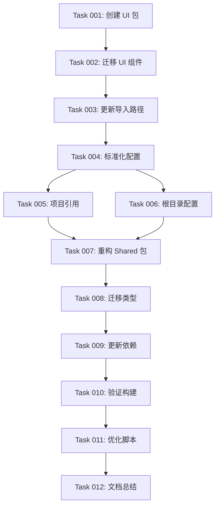

# 📦 Rolitt Monorepo 包架构稳定性改进路线图

> **基于 Claude Code 开发指导原则的结构化实施方案**
>
> 采用 ROADMAP → Tasks → One-Shotting 执行模式，确保项目架构稳定性和可维护性

---

## 🎯 目标概述

### 业务价值
- **提升开发效率**：标准化导入路径，减少相对路径混乱
- **增强代码质量**：清晰的包架构，降低耦合度
- **优化构建性能**：TypeScript 项目引用，支持增量构建
- **降低维护成本**：统一配置管理，减少重复代码

### 技术目标
- 实现 `@rolitt/ui`、`@rolitt/shared` 等标准化导入路径
- 建立清晰的包依赖关系和架构边界
- 优化 TypeScript 配置和构建流程
- 完善工具链和开发体验

### 验收标准
- ✅ 所有包都有清晰的 `@rolitt/*` 导入路径
- ✅ TypeScript 编译和类型检查无错误
- ✅ 构建时间减少 30% 以上
- ✅ 开发启动时间减少 20% 以上
- ✅ 代码重复率降低 50% 以上

---

## 📋 阶段划分

### 第一阶段：核心包架构建立（预估 2-3 小时）

#### 🎯 目标：建立 UI 和 Shared 包的基础架构

- [ ] **Task 001**：创建 UI 包基础架构 - 优先级：高 → See: `/tasks/package/001-create-ui-package.md`
- [ ] **Task 002**：迁移 UI 组件到新包 - 优先级：高 → See: `/tasks/package/002-migrate-ui-components.md`
- [ ] **Task 003**：更新 UI 组件导入路径 - 优先级：高 → See: `/tasks/package/003-update-ui-imports.md`

### 第二阶段：配置标准化（预估 1-2 小时）

#### 🎯 目标：统一所有包的 TypeScript 配置

- [ ] **Task 004**：标准化 TypeScript 配置 - 优先级：高 → See: `/tasks/package/004-standardize-tsconfig.md`
- [ ] **Task 005**：配置 TypeScript 项目引用 - 优先级：中 → See: `/tasks/package/005-setup-project-references.md`
- [ ] **Task 006**：优化根目录配置 - 优先级：中 → See: `/tasks/package/006-update-root-tsconfig.md`

### 第三阶段：共享包优化（预估 2-3 小时）

#### 🎯 目标：重构和优化共享代码

- [ ] **Task 007**：重构 Shared 包结构 - 优先级：高 → See: `/tasks/package/007-refactor-shared-package.md`
- [ ] **Task 008**：迁移共享类型定义 - 优先级：高 → See: `/tasks/package/008-migrate-shared-types.md`
- [ ] **Task 009**：更新包依赖关系 - 优先级：中 → See: `/tasks/package/009-update-package-dependencies.md`

### 第四阶段：验证和优化（预估 1-2 小时）

#### 🎯 目标：确保构建流程和工具链正常工作

- [ ] **Task 010**：验证构建流程 - 优先级：高 → See: `/tasks/package/010-validate-build-process.md`
- [ ] **Task 011**：优化构建脚本 - 优先级：中 → See: `/tasks/package/011-update-build-scripts.md`
- [ ] **Task 012**：完善文档和总结 - 优先级：低 → See: `/tasks/package/012-documentation-and-summary.md`

---

## 🔗 依赖关系

### 前置条件
- ✅ 项目已有基本的 monorepo 结构
- ✅ 使用 npm workspaces
- ✅ 已配置基础的 TypeScript

### 任务依赖图



### 并行执行策略
- **可并行**：Task 005 和 Task 006 可以同时进行
- **必须串行**：Task 001-003 必须按顺序执行
- **条件依赖**：Task 007-009 依赖于前面阶段的完成

---

## 🚀 执行策略

### One-Shotting 执行模式

#### 标准执行命令
```bash
# 执行单个任务
Based on /tasks/package/001-create-ui-package.md, complete the task in one shot.

# 执行相关任务组
Based on /tasks/package/001-create-ui-package.md, /tasks/package/002-migrate-ui-components.md, and /tasks/package/003-update-ui-imports.md, complete the UI package setup in coordinated steps.
```

#### 复杂任务预处理
```bash
# 分析依赖后执行
First, analyze /tasks/package/007-refactor-shared-package.md and /tasks/package/008-migrate-shared-types.md for dependencies, then execute the independent parts in one shot.
```

### 🎯 执行检查清单

**每个任务执行前**：
- [ ] 任务文件已导入到 Claude 上下文
- [ ] 相关代码文件已查看
- [ ] 依赖关系已确认
- [ ] 验收标准已明确

**每个任务执行中**：
- [ ] 严格按照任务步骤执行
- [ ] 遵循项目代码规范
- [ ] 保持代码风格一致性
- [ ] 添加必要的错误处理

**每个任务执行后**：
- [ ] 验证功能正常运行
- [ ] 更新任务状态
- [ ] 提交代码变更
- [ ] 更新相关文档

---

## 📊 风险评估与缓解

### 🔴 高风险项

#### 1. 导入路径大规模变更
**风险**：可能导致编译错误或运行时错误
**缓解措施**：
- 分阶段执行，每次只改一个包
- 每步都进行编译验证
- 保留回滚方案

#### 2. TypeScript 配置冲突
**风险**：新配置可能与现有代码不兼容
**缓解措施**：
- 先在测试分支验证
- 逐步迁移，保持向后兼容
- 详细记录配置变更

### 🟡 中风险项

#### 1. 构建性能回退
**风险**：新配置可能影响构建速度
**缓解措施**：
- 建立性能基准
- 监控构建时间变化
- 优化配置参数

#### 2. 开发体验变化
**风险**：开发者需要适应新的导入方式
**缓解措施**：
- 提供详细的迁移指南
- 配置 IDE 自动补全
- 团队培训和文档

---

## 🎯 成功指标

### 📈 性能指标
- **构建时间**：减少 30% 以上
- **增量构建**：减少 50% 以上
- **类型检查**：减少 40% 以上
- **开发启动**：减少 20% 以上

### 📋 质量指标
- **TypeScript 错误**：0 个编译错误
- **ESLint 错误**：0 个 linting 错误
- **测试覆盖率**：保持现有水平
- **包大小**：不显著增加

### 🛠️ 开发体验指标
- **导入路径**：100% 使用 `@rolitt/*` 格式
- **代码重复**：减少 50% 以上
- **配置一致性**：100% 标准化
- **文档完整性**：100% 覆盖新架构

---

## 📞 支持与监控

### 🔍 监控机制
- **构建监控**：每次构建记录性能指标
- **错误监控**：TypeScript 和 ESLint 错误追踪
- **依赖监控**：包依赖关系健康检查
- **性能监控**：开发和构建时间追踪

### 🆘 应急预案
- **回滚策略**：每个阶段都有完整的回滚方案
- **问题诊断**：详细的故障排查指南
- **团队支持**：指定技术负责人和联系方式
- **文档备份**：保留所有配置变更记录

---

## 🎉 预期收益

### 短期收益（1-2 周）
- ✅ 清晰的包架构和导入路径
- ✅ 减少相对路径导致的错误
- ✅ 统一的 TypeScript 配置
- ✅ 改善的开发体验

### 中期收益（1-2 月）
- ✅ 显著提升的构建性能
- ✅ 更好的代码复用和维护性
- ✅ 降低的新人上手成本
- ✅ 更稳定的 CI/CD 流程

### 长期收益（3-6 月）
- ✅ 支持大规模团队协作
- ✅ 便于新包和功能的添加
- ✅ 更好的代码质量和一致性
- ✅ 为微前端架构打下基础

---

**🎯 记住：遵循 Claude Code 最佳实践 - 结构化思考 + 原子化执行 + 持续迭代优化！**

**📋 下一步**：开始执行 Task 001，创建 UI 包基础架构。

**执行命令**：`Based on /tasks/package/001-create-ui-package.md, complete the task in one shot.`
