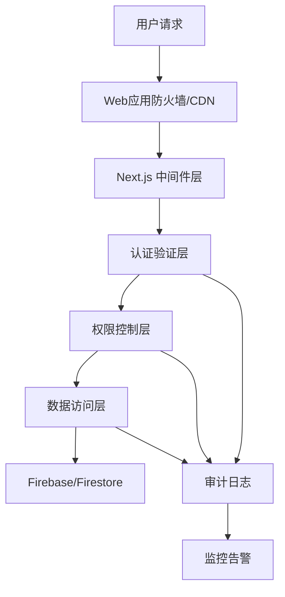

# Firebase Auth 集成方案

基于 Next.js 15 + Firebase Auth 的企业级用户认证解决方案

## 🔒 安全优先的认证架构

### 核心安全原则
本方案以**安全为第一优先级**，采用多层防护体系：

- **零信任架构**：假设网络边界不可信，每个请求都需验证
- **最小权限原则**：用户只能访问必需的资源和功能
- **深度防御**：多层安全控制，任何单点失效都不会危及整体安全
- **审计追踪**：所有用户行为和系统事件都有完整日志记录

### 安全合规目标
- ✅ **GDPR 合规**：完整的数据保护和用户权利实现
- ✅ **PCI DSS**：支付数据安全标准（配合 Stripe）
- ✅ **ISO 27001**：信息安全管理体系
- ✅ **SOC 2 Type II**：服务组织控制审计标准

## 🏗️ 系统架构设计

### 技术栈选择
```typescript
// 核心认证层
Firebase Auth          // 身份认证服务
Firestore             // 用户数据存储
Firebase Security Rules // 数据访问控制

// 应用框架层
Next.js 15            // 全栈框架
TypeScript (严格模式)  // 类型安全
React 19              // UI 框架

// 安全增强层
Arcjet                // 速率限制和攻击防护
@t3-oss/env-nextjs   // 环境变量验证
Zod                   // 数据验证

// 集成系统（未来）
Shopify Storefront API // 电商系统
Stripe                // 支付系统

// 支付系统架构
Payment Gateway Layer  // 支付网关抽象层
Multiple Providers    // 多支付提供商支持
Webhook Processing    // 支付状态同步
Transaction Storage   // 交易数据存储
```

### 安全架构分层



### 实施架构与开发规范

为确保代码质量和长期可维护性，所有 Firebase 相关开发需遵循以下架构原则：

- **技术栈统一**: 用户中心（Dashboard）及所有相关管理页面，必须使用项目现有技术栈（Next.js, Tailwind CSS, shadcn/ui）进行开发，以保证技术统一和 UI 风格一致性。

- **目录结构**: 所有需要用户认证后才能访问的页面（例如用户仪表盘、账户设置等）必须放置在 `src/app/[locale]/(auth)/` 路由组中。这有利于通过 `layout.tsx` 实现独立的页面布局和集中的路由保护。

- **关注点分离 (解耦)**: 严格遵循分层架构，将不同职责的代码解耦。
  - **配置层 (`src/libs/firebase`)**: 此为全项目唯一的 Firebase 初始化入口。所有 Firebase 服务的配置和实例化（如 `auth`, `db`, `adminDb`）必须在此处集中管理。
  - **服务层 (`src/libs/integration`)**: 此层封装所有与后端服务（如 Firestore）的直接交互逻辑。例如，`FirestoreUserService` 负责所有用户数据的 CRUD 操作。UI 组件不应直接调用 Firestore API。
  - **表现层/UI层 (`src/components/`, `src/app/`)**: React 组件应保持"纯粹"，只负责展示 UI 和处理用户输入。它们通过调用服务层的方法来获取数据或执行操作，从而与业务逻辑解耦。

## 🔐 完整安全设计

### 1. 身份认证安全

#### 多因素认证（MFA）
```typescript
// src/libs/firebase/auth-security.ts
type MFAConfig = {
  required: boolean;
  methods: ('sms' | 'totp' | 'email')[];
  gracePeriod: number; // 强制启用前的宽限期（天）
  exemptRoles: string[]; // 豁免角色
};

type PasswordPolicy = {
  minLength: 12;
  requireUppercase: true;
  requireLowercase: true;
  requireNumbers: true;
  requireSpecialChars: true;
  preventReuse: 5; // 防止重复使用最近5个密码
  maxAge: 90; // 密码最大有效期（天）
};
```

#### 会话安全管理
```typescript
// src/libs/firebase/session-manager.ts
interface SessionSecurity {
  // JWT Token 安全
  accessTokenTTL: 15 * 60 * 1000; // 15分钟
  refreshTokenTTL: 7 * 24 * 60 * 60 * 1000; // 7天
  tokenRotation: true; // 每次刷新都轮换token

  // 会话约束
  maxConcurrentSessions: 3; // 最大并发会话数
  sessionTimeout: 30 * 60 * 1000; // 30分钟无操作超时
  deviceFingerprinting: true; // 设备指纹识别

  // 安全策略
  forceLogoutOnSuspicion: true; // 可疑活动强制登出
  ipWhitelisting: false; // IP白名单（可选）
  geoBlocking: string[]; // 地理位置阻断列表
}
```

### 2. 数据保护安全

#### Firestore 安全规则
```javascript
// firestore.rules - 企业级安全规则
rules_version = '2';
service cloud.firestore {
  match /databases/{database}/documents {
    // 用户数据保护
    match /users/{userId} {
      allow read, write: if request.auth != null
        && request.auth.uid == userId
        && isValidUserData(request.resource.data);

      // 管理员只读访问（审计需要）
      allow read: if request.auth != null
        && hasAdminRole(request.auth);
    }

    // 用户活动日志（只允许创建，不允许修改）
    match /audit_logs/{logId} {
      allow create: if request.auth != null
        && request.resource.data.userId == request.auth.uid;
      allow read: if request.auth != null
        && hasAdminRole(request.auth);
    }

    // 敏感数据加密存储
    match /sensitive_data/{dataId} {
      allow read, write: if request.auth != null
        && hasEncryptionKey(request.auth)
        && request.resource.data.encrypted == true;
    }

    // 函数：验证用户数据
    function isValidUserData(data) {
      return data.keys().hasAll(['email', 'displayName', 'updatedAt'])
        && data.email is string
        && data.email.matches('.*@.*\\..*')
        && data.displayName is string
        && data.displayName.size() <= 100;
    }

    // 函数：检查管理员角色
    function hasAdminRole(auth) {
      return auth.token.role == 'admin'
        && auth.token.email_verified == true;
    }
  }
}
```

#### 数据加密策略
```typescript
// src/libs/firebase/encryption.ts
import { AES, enc } from 'crypto-js';

type DataEncryption = {
  // 敏感字段加密
  encryptSensitiveFields: (data: any) => any;
  decryptSensitiveFields: (data: any) => any;

  // PII数据处理
  hashPII: (data: string) => string;
  tokenizePII: (data: string) => string;

  // 密钥管理
  rotateKeys: () => Promise<void>;
  getActiveKey: () => Promise<string>;
};

// 敏感数据字段定义
const SENSITIVE_FIELDS = [
  'creditCard',
  'ssn',
  'passport',
  'phoneNumber',
  'personalId'
];

export class SecureDataManager implements DataEncryption {
  private readonly keyRotationInterval = 90 * 24 * 60 * 60 * 1000; // 90天

  async encryptSensitiveFields(data: any): Promise<any> {
    const encrypted = { ...data };
    const activeKey = await this.getActiveKey();

    for (const field of SENSITIVE_FIELDS) {
      if (encrypted[field]) {
        encrypted[field] = AES.encrypt(
          encrypted[field],
          activeKey
        ).toString();
        encrypted[`${field}_encrypted`] = true;
      }
    }

    return encrypted;
  }

  async decryptSensitiveFields(data: any): Promise<any> {
    const decrypted = { ...data };
    const activeKey = await this.getActiveKey();

    for (const field of SENSITIVE_FIELDS) {
      if (decrypted[field] && decrypted[`${field}_encrypted`]) {
        const bytes = AES.decrypt(decrypted[field], activeKey);
        decrypted[field] = bytes.toString(enc.Utf8);
        delete decrypted[`${field}_encrypted`];
      }
    }

    return decrypted;
  }

  async rotateKeys(): Promise<void> {
    // 实现密钥轮换逻辑
    const newKey = this.generateSecureKey();
    await this.storeKeySecurely(newKey);
    await this.markOldKeyForDeprecation();
  }
}
```

### 3. 权限控制系统

#### 基于角色的访问控制（RBAC）
```typescript
// src/types/rbac.ts
type Role = {
  id: string;
  name: string;
  permissions: Permission[];
  inherits: string[]; // 继承其他角色
  conditions: RoleCondition[]; // 角色生效条件
};

type Permission = {
  resource: string; // 'users' | 'products' | 'orders' | 'admin'
  actions: Action[]; // ['create', 'read', 'update', 'delete']
  scope: PermissionScope; // 'own' | 'team' | 'organization' | 'global'
  conditions: PermissionCondition[]; // 额外条件
};

type PermissionCondition = {
  field: string; // 字段名
  operator: 'equals' | 'in' | 'gt' | 'lt' | 'contains';
  value: any; // 比较值
  context: 'user' | 'resource' | 'time'; // 上下文来源
};

// 预定义角色
const SYSTEM_ROLES: Role[] = [
  {
    id: 'customer',
    name: '客户',
    permissions: [
      {
        resource: 'profile',
        actions: ['read', 'update'],
        scope: 'own',
        conditions: []
      },
      {
        resource: 'orders',
        actions: ['read', 'create'],
        scope: 'own',
        conditions: []
      }
    ],
    inherits: [],
    conditions: [
      {
        field: 'emailVerified',
        operator: 'equals',
        value: true,
        context: 'user'
      }
    ]
  },
  {
    id: 'premium_customer',
    name: '高级客户',
    permissions: [
      {
        resource: 'products',
        actions: ['read'],
        scope: 'global',
        conditions: [
          {
            field: 'tier',
            operator: 'in',
            value: ['premium', 'exclusive'],
            context: 'resource'
          }
        ]
      }
    ],
    inherits: ['customer'],
    conditions: [
      {
        field: 'subscriptionTier',
        operator: 'in',
        value: ['premium', 'enterprise'],
        context: 'user'
      }
    ]
  },
  {
    id: 'admin',
    name: '管理员',
    permissions: [
      {
        resource: '*',
        actions: ['create', 'read', 'update', 'delete'],
        scope: 'global',
        conditions: []
      }
    ],
    inherits: [],
    conditions: [
      {
        field: 'adminVerified',
        operator: 'equals',
        value: true,
        context: 'user'
      },
      {
        field: 'lastSecurityTraining',
        operator: 'gt',
        value: Date.now() - 90 * 24 * 60 * 60 * 1000, // 90天内
        context: 'user'
      }
    ]
  }
];
```

#### 权限验证引擎
```typescript
// src/libs/rbac/permission-engine.ts
type PermissionEngine = {
  checkPermission: (
    userId: string,
    resource: string,
    action: string,
    context?: any
  ) => Promise<boolean>;

  getUserPermissions: (userId: string) => Promise<Permission[]>;
  assignRole: (userId: string, roleId: string) => Promise<void>;
  revokeRole: (userId: string, roleId: string) => Promise<void>;
};

export class FirebasePermissionEngine implements PermissionEngine {
  async checkPermission(
    userId: string,
    resource: string,
    action: string,
    context: any = {}
  ): Promise<boolean> {
    // 1. 获取用户角色
    const userRoles = await this.getUserRoles(userId);

    // 2. 解析所有有效权限
    const permissions = await this.resolvePermissions(userRoles);

    // 3. 查找匹配的权限
    const matchingPermissions = permissions.filter(p =>
      (p.resource === resource || p.resource === '*')
      && p.actions.includes(action)
    );

    // 4. 验证权限条件
    for (const permission of matchingPermissions) {
      if (await this.evaluateConditions(permission.conditions, userId, context)) {
        return true;
      }
    }

    // 5. 记录权限拒绝日志
    await this.logPermissionDenied(userId, resource, action, context);

    return false;
  }
}
```

### 4. 安全监控和审计

#### 实时威胁检测
```typescript
// src/libs/security/threat-detection.ts
type ThreatLevel = 'low' | 'medium' | 'high' | 'critical';

type LoginContext = {
  ipAddress: string;
  userAgent: string;
  location: GeoLocation;
  deviceFingerprint: string;
  timestamp: Date;
};

type SecurityResponse = {
  action: 'allow' | 'challenge' | 'block' | 'quarantine';
  message: string;
  additionalAuth: ('mfa' | 'captcha' | 'device_verification')[];
  lockoutDuration?: number; // 秒
};

export class AIThreatDetector {
  async detectAnomalousLogin(
    userId: string,
    context: LoginContext
  ): Promise<ThreatLevel> {
    const userProfile = await this.getUserSecurityProfile(userId);

    // 检查多个异常指标
    const indicators = await Promise.all([
      this.checkLocationAnomaly(userProfile.recentLocations, context.location),
      this.checkTimeAnomaly(userProfile.recentLogins, context.timestamp),
      this.checkDeviceAnomaly(userProfile.knownDevices, context.deviceFingerprint),
      this.checkVelocityAnomaly(userProfile.recentActivity, context.timestamp)
    ]);

    // AI风险评分算法
    const riskScore = this.calculateRiskScore(indicators);

    if (riskScore > 0.8) {
      return 'critical';
    }
    if (riskScore > 0.6) {
      return 'high';
    }
    if (riskScore > 0.4) {
      return 'medium';
    }
    return 'low';
  }

  async generateSecurityResponse(
    threatLevel: ThreatLevel,
    context: SecurityContext
  ): Promise<SecurityResponse> {
    switch (threatLevel) {
      case 'critical':
        return {
          action: 'block',
          message: '检测到高风险活动，账户已被临时锁定',
          additionalAuth: ['mfa', 'device_verification'],
          lockoutDuration: 3600 // 1小时
        };

      case 'high':
        return {
          action: 'challenge',
          message: '检测到异常活动，需要额外验证',
          additionalAuth: ['mfa', 'captcha']
        };

      case 'medium':
        return {
          action: 'challenge',
          message: '为了您的账户安全，请完成验证',
          additionalAuth: ['captcha']
        };

      default:
        return {
          action: 'allow',
          message: '',
          additionalAuth: []
        };
    }
  }
}
```

#### 审计日志系统
```typescript
// src/libs/audit/audit-logger.ts
type AuditEvent = {
  id: string;
  type: AuditEventType;
  userId?: string;
  sessionId?: string;
  resource?: string;
  action?: string;
  result: 'success' | 'failure' | 'error';
  details: Record<string, any>;
  metadata: {
    ipAddress: string;
    userAgent: string;
    timestamp: Date;
    traceId: string; // 分布式追踪ID
  };
  severity: 'info' | 'warning' | 'error' | 'critical';
  retention: number; // 保留天数
};

type AuditEventType
  = | 'USER_LOGIN' | 'USER_LOGOUT' | 'USER_REGISTRATION'
    | 'PERMISSION_GRANTED' | 'PERMISSION_DENIED'
    | 'DATA_ACCESS' | 'DATA_MODIFICATION' | 'DATA_DELETION'
    | 'ADMIN_ACTION' | 'SECURITY_ALERT'
    | 'SYSTEM_ERROR' | 'CONFIGURATION_CHANGE';

export class ComplianceAuditLogger {
  async log(event: Partial<AuditEvent>): Promise<void> {
    const auditEvent: AuditEvent = {
      id: this.generateEventId(),
      type: event.type!,
      userId: event.userId,
      sessionId: event.sessionId,
      resource: event.resource,
      action: event.action,
      result: event.result || 'success',
      details: event.details || {},
      metadata: {
        ipAddress: event.metadata?.ipAddress || 'unknown',
        userAgent: event.metadata?.userAgent || 'unknown',
        timestamp: new Date(),
        traceId: event.metadata?.traceId || this.generateTraceId()
      },
      severity: event.severity || 'info',
      retention: this.getRetentionPeriod(event.type!, event.severity!)
    };

    // 同时写入多个存储
    await Promise.all([
      this.writeToFirestore(auditEvent),
      this.writeToSecureLog(auditEvent),
      this.writeToAnalytics(auditEvent)
    ]);

    // 实时告警检查
    if (auditEvent.severity === 'critical') {
      await this.triggerSecurityAlert(auditEvent);
    }
  }

  private getRetentionPeriod(type: AuditEventType, severity: string): number {
    // 合规要求：不同类型的日志有不同的保留期
    const retentionMap: Record<string, number> = {
      USER_LOGIN: 365, // 登录日志保留1年
      PERMISSION_DENIED: 2555, // 权限拒绝保留7年（合规要求）
      DATA_DELETION: 2555, // 数据删除保留7年
      ADMIN_ACTION: 2555, // 管理员操作保留7年
      SECURITY_ALERT: 2555, // 安全警报保留7年
      DATA_ACCESS: 90, // 一般数据访问保留90天
      SYSTEM_ERROR: 30 // 系统错误保留30天
    };

    const baseRetention = retentionMap[type] || 30;

    // 严重级别的事件保留更长时间
    if (severity === 'critical') {
      return Math.max(baseRetention, 2555); // 至少7年
    }

    return baseRetention;
  }
}
```

## 🏛️ 合规性架构

### GDPR 数据保护
```typescript
// src/libs/compliance/gdpr.ts
export class GDPRCompliance {
  // 数据可携带权（导出用户数据）
  async exportUserData(userId: string): Promise<UserDataExport> {
    const userProfile = await this.getUserProfile(userId);
    const userOrders = await this.getUserOrders(userId);
    const userPreferences = await this.getUserPreferences(userId);

    return {
      personal_data: userProfile,
      transaction_history: userOrders,
      preferences: userPreferences,
      export_date: new Date().toISOString(),
      format: 'JSON',
      verification: await this.generateDataHash({
        userProfile,
        userOrders,
        userPreferences
      })
    };
  }

  // 遗忘权（删除用户数据）
  async deleteUserData(userId: string, reason: string): Promise<DeletionReport> {
    const deletionId = this.generateDeletionId();

    try {
      // 1. 标记删除开始
      await this.markDeletionStart(userId, deletionId, reason);

      // 2. 删除个人数据
      await this.deletePersonalData(userId);

      // 3. 匿名化交易数据（保留分析需要）
      await this.anonymizeTransactionData(userId);

      // 4. 删除会话和缓存
      await this.clearUserSessions(userId);

      // 5. 记录删除日志（合规要求）
      await this.logDataDeletion(userId, deletionId, reason);

      return {
        deletionId,
        userId,
        status: 'completed',
        deletedData: ['profile', 'preferences', 'sessions'],
        anonymizedData: ['orders', 'analytics'],
        completedAt: new Date(),
        compliance: 'GDPR Article 17'
      };
    } catch (error) {
      await this.logDeletionError(userId, deletionId, error);
      throw new GDPRComplianceError('数据删除失败', error);
    }
  }
}
```

### PCI DSS 支付安全
```typescript
// src/libs/compliance/pci-dss.ts
export class PCIDSSCompliance {
  // 确保支付数据不存储在本地
  async processPayment(paymentData: PaymentRequest): Promise<PaymentResult> {
    // 验证：绝不存储信用卡数据
    if (this.containsCreditCardData(paymentData)) {
      throw new SecurityError('禁止存储信用卡数据');
    }

    // 使用 Stripe 安全处理
    const stripeToken = await this.tokenizePaymentData(paymentData);

    // 记录支付审计日志（不包含敏感数据）
    await this.auditLogger.log({
      type: 'PAYMENT_PROCESSED',
      userId: paymentData.userId,
      details: {
        amount: paymentData.amount,
        currency: paymentData.currency,
        merchant_id: paymentData.merchantId,
        // 绝不记录卡号或CVV
      },
      severity: 'info'
    });

    return this.processWithStripe(stripeToken);
  }
}
```

## 📋 实施优先级

### 第一阶段：核心安全基础（1-2周）
1. **环境变量清理和配置**
   - 移除所有 Clerk 相关配置
   - 配置 Firebase 环境变量
   - 设置安全的密钥管理

2. **Firebase 项目初始化**
   - 创建 Firebase 项目
   - 配置身份认证规则
   - 设置 Firestore 安全规则

3. **基础认证流程**
   - 用户注册/登录
   - 邮箱验证
   - 密码重置

### 第二阶段：安全增强（2-3周）
1. **多因素认证（MFA）**
2. **会话安全管理**
3. **权限控制系统**
4. **审计日志系统**

### 第三阶段：系统集成（2-3周）
1. **Shopify 用户同步**
2. **Stripe 支付集成**
3. **AI 系统集成**
4. **监控和告警系统**

### 第四阶段：合规性完善（1-2周）
1. **GDPR 合规功能**
2. **PCI DSS 验证**
3. **安全审计和测试**
4. **文档和培训**

## 总结

这是一个**安全优先、企业级**的 Firebase Auth 集成方案，关键特点：

✅ **零迁移风险** - 无 Clerk 历史包袱，直接实施
✅ **安全为先** - 多层防护，满足企业级安全要求
✅ **合规就绪** - GDPR、PCI DSS 等合规标准
✅ **架构优化** - 组件化、解耦设计，易于维护扩展

**推荐立即开始第一阶段实施**，为后续 Shopify 和 AI 集成奠定坚实的安全基础。

---

## 💳 支付系统集成

本项目采用解耦的支付系统架构，支持多种支付提供商，确保API版本稳定性和企业级安全合规。

### 支付系统特性
- **多提供商支持**：Stripe、PayPal、微信支付、支付宝等
- **解耦架构**：支付提供商无关的设计
- **API版本稳定**：固定版本锁定，向后兼容
- **安全合规**：PCI DSS合规，数据加密存储
- **Firebase集成**：用户支付数据无缝同步

### 用户支付数据结构
```typescript
// 扩展用户类型定义以支持支付信息
type UserProfile = {
  // ... 现有字段

  // 支付相关字段
  stripeCustomerId?: string; // Stripe客户ID
  subscriptionPlan?: string; // 订阅计划
  subscriptionStatus?: string; // 订阅状态
  subscriptionId?: string; // 订阅ID
  subscriptionProvider?: string; // 支付提供商
  subscriptionCurrentPeriodEnd?: Date; // 当前订阅周期结束时间

  // 多提供商支持
  paymentProviders?: {
    [provider: string]: {
      customerId: string;
      status: 'active' | 'inactive';
      createdAt: Date;
    };
  };

  // 支付历史（最近50条）
  paymentHistory?: PaymentRecord[];
  lastPaymentAt?: Date;
};

type PaymentRecord = {
  id: string;
  amount: number;
  currency: string;
  status: string;
  provider: string;
  timestamp: Date;
  description?: string;
};
```

### Firebase用户数据同步
支付系统通过专门的同步服务将支付状态和订阅信息实时同步到Firebase用户记录：

1. **客户ID映射**：Firebase UID ↔ 支付提供商客户ID
2. **订阅状态同步**：实时更新用户订阅状态和计划信息
3. **支付历史记录**：维护用户支付历史记录（脱敏处理）
4. **权限更新**：基于订阅状态自动更新用户权限

### 安全和合规
- **PCI DSS合规**：不存储敏感支付卡信息
- **数据加密**：敏感数据端到端加密
- **审计日志**：完整的支付操作审计追踪
- **权限控制**：基于Firebase Auth的支付权限管理

**详细的支付系统架构和实现请参考：[支付系统集成文档](./payment-system-integration.md)**
