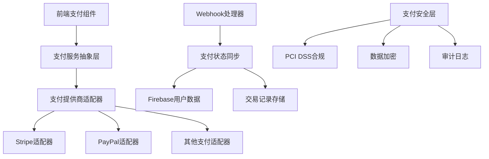

# 🏦 支付系统集成架构方案

## 📋 文档概述

本文档详细描述了项目的支付系统集成架构，采用解耦设计支持多支付提供商，确保API版本稳定性和企业级安全合规。

**关联文档：**
- [Firebase认证集成](./firebase-auth-integration.md) - 用户认证和数据管理
- [系统架构设计](./system-architecture.md) - 整体系统架构
- [实施路线图](./implementation-roadmap.md) - 项目实施计划

---

## 🎯 设计原则

### 1. 解耦架构设计
本方案采用**支付提供商无关**的架构设计，确保：
- **多支付方式支持**：Stripe、PayPal等，stripe 为第一优先
- **提供商切换**：无需修改业务逻辑即可切换支付提供商
- **渐进式集成**：支持逐步添加新的支付方式
- **故障隔离**：单个支付提供商故障不影响整体系统

### 2. API版本稳定性
- **固定版本锁定**：使用 Stripe API `2025-06-30.basil` 版本
- **向后兼容层**：支持API版本升级的兼容处理
- **版本验证**：启动时验证API版本兼容性
- **渐进升级**：支持蓝绿部署和灰度发布

### 3. 安全优先原则
- **PCI DSS合规**：满足支付卡行业数据安全标准
- **数据加密**：敏感数据端到端加密存储
- **审计追踪**：完整的支付操作审计日志
- **权限控制**：基于角色的支付权限管理

### 4. 双重API路由架构
本项目采用双重API路由结构，分别服务于不同的业务需求：

#### 4.1 国际化API路由 (`[locale]/api/`)
**路径格式**：`/{locale}/api/payments/create-intent`
- **适用场景**：需要多语言支持的业务功能
- **支付相关API**：支付意图创建、订阅管理、账单门户等
- **用户界面API**：需要根据用户语言环境返回本地化内容的接口
- **动态路由**：根据当前语言环境自动路由到对应的处理器

**技术优势**：
- **多语言支持**：自动处理不同语言环境下的业务逻辑
- **本地化响应**：错误消息、状态描述等自动本地化
- **SEO友好**：支持多语言URL结构，提升国际化SEO效果
- **用户体验**：确保支付流程在所有支持语言下的一致性

#### 4.2 全局API路由 (`api/`)
**路径格式**：`/api/contact` 或 `/api/system/health`
- **适用场景**：语言无关的系统级功能
- **系统监控**：健康检查、性能监控、日志收集等
- **第三方集成**：Webhook接收、外部服务回调等
- **管理功能**：系统配置、缓存管理、数据同步等

**技术优势**：
- **性能优化**：避免不必要的国际化处理开销
- **简化维护**：系统级API无需考虑多语言复杂性
- **标准化接口**：为第三方服务提供统一的接口规范
- **安全隔离**：将系统级功能与用户级功能分离

#### 4.3 架构决策的业务价值

**开发效率提升**：
- 开发者可以根据功能特性选择合适的路由结构
- 减少国际化相关的重复代码和配置
- 简化API测试和调试流程

**系统可维护性**：
- 清晰的职责分离，便于团队协作开发
- 独立的部署和扩展策略
- 降低系统复杂度和耦合度

**用户体验优化**：
- 支付流程的完整国际化支持
- 更快的系统级API响应速度
- 一致的多语言用户界面

**技术债务控制**：
- 避免在系统级API中引入不必要的国际化依赖
- 为未来的微服务拆分提供清晰的边界
- 支持渐进式的架构演进

---

## 🏗️ 系统架构

### 核心架构分层


### 目录结构设计
```
src/
├── libs/
│   ├── payments/
│   │   ├── core/
│   │   │   ├── payment-service.ts      # 统一支付服务
│   │   │   ├── payment-types.ts        # 支付类型定义
│   │   │   └── payment-errors.ts       # 支付错误处理
│   │   ├── providers/
│   │   │   ├── base-provider.ts        # 支付提供商基类
│   │   │   ├── stripe/
│   │   │   │   ├── stripe-provider.ts  # Stripe适配器
│   │   │   │   ├── stripe-client.ts    # Stripe客户端
│   │   │   │   ├── stripe-webhooks.ts  # Stripe Webhook
│   │   │   │   └── stripe-types.ts     # Stripe类型定义
│   │   │   ├── paypal/
│   │   │   │   └── paypal-provider.ts  # PayPal适配器
│   │   │   └── wechat/
│   │   │       └── wechat-provider.ts  # 微信支付适配器
│   │   ├── storage/
│   │   │   ├── transaction-store.ts    # 交易数据存储
│   │   │   └── payment-cache.ts        # 支付缓存
│   │   └── security/
│   │       ├── payment-encryption.ts   # 支付数据加密
│   │       └── pci-compliance.ts       # PCI DSS合规
│   └── firebase/
│       └── user-payment-sync.ts        # 用户支付数据同步
├── app/
│   └── [locale]/
│       └── api/
│           ├── payments/
│           │   ├── create-intent/route.ts      # 创建支付意图
│           │   ├── confirm-payment/route.ts    # 确认支付
│           │   ├── cancel-payment/route.ts     # 取消支付
│           │   └── payment-methods/route.ts    # 支付方式管理
│           ├── subscriptions/
│           │   ├── create/route.ts             # 创建订阅
│           │   ├── update/route.ts             # 更新订阅
│           │   ├── cancel/route.ts             # 取消订阅
│           │   └── billing-portal/route.ts     # 账单门户
│           └── webhooks/
│               ├── stripe/route.ts             # Stripe Webhook
│               ├── paypal/route.ts             # PayPal Webhook
│               └── webhook-validator.ts        # Webhook验证
└── components/
    └── payments/
        ├── PaymentForm.tsx                     # 支付表单
        ├── PaymentMethodSelector.tsx          # 支付方式选择
        ├── SubscriptionManager.tsx            # 订阅管理
        ├── PaymentHistory.tsx                 # 支付历史
        └── BillingPortal.tsx                  # 账单门户
```

---

## 🔧 核心实现

### 1. 支付提供商抽象接口
```typescript
// src/libs/payments/core/payment-types.ts
export type PaymentProvider = {
  readonly name: string;
  readonly version: string;

  // 客户管理
  createCustomer: (user: UserProfile) => Promise<PaymentCustomer>;
  updateCustomer: (customerId: string, data: Partial<CustomerData>) => Promise<PaymentCustomer>;
  deleteCustomer: (customerId: string) => Promise<void>;

  // 支付处理
  createPaymentIntent: (request: PaymentIntentRequest) => Promise<PaymentIntent>;
  confirmPayment: (paymentId: string, paymentMethod: string) => Promise<PaymentResult>;
  cancelPayment: (paymentId: string) => Promise<PaymentResult>;

  // 订阅管理
  createSubscription: (request: SubscriptionRequest) => Promise<Subscription>;
  updateSubscription: (subscriptionId: string, updates: SubscriptionUpdate) => Promise<Subscription>;
  cancelSubscription: (subscriptionId: string) => Promise<Subscription>;

  // Webhook处理
  validateWebhook: (payload: string, signature: string) => Promise<WebhookEvent>;
  processWebhook: (event: WebhookEvent) => Promise<WebhookResult>;
};

export type PaymentIntentRequest = {
  amount: number;
  currency: string;
  customerId: string;
  description?: string;
  metadata?: Record<string, string>;
  paymentMethodTypes?: string[];
  captureMethod?: 'automatic' | 'manual';
};

export type PaymentIntent = {
  id: string;
  clientSecret: string;
  status: PaymentStatus;
  amount: number;
  currency: string;
  customerId: string;
  createdAt: Date;
  metadata?: Record<string, any>;
};

export type PaymentStatus
  = | 'requires_payment_method'
    | 'requires_confirmation'
    | 'requires_action'
    | 'processing'
    | 'succeeded'
    | 'canceled'
    | 'failed';

export type SubscriptionRequest = {
  customerId: string;
  priceId: string;
  quantity?: number;
  trialPeriodDays?: number;
  metadata?: Record<string, string>;
};

export type WebhookEvent = {
  id: string;
  type: string;
  data: any;
  created: Date;
  provider: string;
};
```

### 2. Stripe 提供商实现
```typescript
// src/libs/payments/providers/stripe/stripe-provider.ts
import Stripe from 'stripe';
import { Env } from '@/libs/Env';
import { PaymentIntent, PaymentIntentRequest, PaymentProvider } from '../../core/payment-types';

export class StripePaymentProvider implements PaymentProvider {
  readonly name = 'stripe';
  readonly version = '2025-06-30.basil';

  private stripe: Stripe;

  constructor() {
    this.stripe = new Stripe(Env.STRIPE_SECRET_KEY, {
      apiVersion: '2025-06-30.basil',
      typescript: true,
    });
  }

  async createCustomer(user: UserProfile): Promise<PaymentCustomer> {
    const customer = await this.stripe.customers.create({
      email: user.email,
      name: user.displayName,
      metadata: {
        firebaseUid: user.uid,
        source: 'firebase_sync',
        createdAt: new Date().toISOString()
      }
    });

    return {
      id: customer.id,
      email: customer.email!,
      name: customer.name!,
      provider: 'stripe',
      metadata: customer.metadata
    };
  }

  async createPaymentIntent(request: PaymentIntentRequest): Promise<PaymentIntent> {
    const paymentIntent = await this.stripe.paymentIntents.create({
      amount: request.amount,
      currency: request.currency,
      customer: request.customerId,
      description: request.description,
      metadata: request.metadata,
      payment_method_types: request.paymentMethodTypes || ['card'],
      capture_method: request.captureMethod || 'automatic',
      // 安全设置
      setup_future_usage: 'off_session', // 支持后续支付
      confirmation_method: 'manual',
      confirm: false
    });

    return {
      id: paymentIntent.id,
      clientSecret: paymentIntent.client_secret!,
      status: this.mapStripeStatus(paymentIntent.status),
      amount: paymentIntent.amount,
      currency: paymentIntent.currency,
      customerId: paymentIntent.customer as string,
      createdAt: new Date(paymentIntent.created * 1000),
      metadata: paymentIntent.metadata
    };
  }

  async validateWebhook(payload: string, signature: string): Promise<WebhookEvent> {
    try {
      const event = this.stripe.webhooks.constructEvent(
        payload,
        signature,
        Env.STRIPE_WEBHOOK_SECRET
      );

      return {
        id: event.id,
        type: event.type,
        data: event.data,
        created: new Date(event.created * 1000),
        provider: 'stripe'
      };
    } catch (error) {
      throw new WebhookValidationError('Stripe webhook validation failed', error);
    }
  }

  async processWebhook(event: WebhookEvent): Promise<WebhookResult> {
    switch (event.type) {
      case 'payment_intent.succeeded':
        return await this.handlePaymentSuccess(event.data.object);

      case 'payment_intent.payment_failed':
        return await this.handlePaymentFailure(event.data.object);

      case 'customer.subscription.created':
      case 'customer.subscription.updated':
        return await this.handleSubscriptionUpdate(event.data.object);

      case 'customer.subscription.deleted':
        return await this.handleSubscriptionCancellation(event.data.object);

      case 'invoice.payment_succeeded':
        return await this.handleInvoicePayment(event.data.object);

      default:
        return {
          processed: false,
          message: `Unhandled event type: ${event.type}`
        };
    }
  }

  private mapStripeStatus(stripeStatus: string): PaymentStatus {
    const statusMap: Record<string, PaymentStatus> = {
      requires_payment_method: 'requires_payment_method',
      requires_confirmation: 'requires_confirmation',
      requires_action: 'requires_action',
      processing: 'processing',
      succeeded: 'succeeded',
      canceled: 'canceled'
    };

    return statusMap[stripeStatus] || 'failed';
  }
}
```

### 3. 统一支付服务
```typescript
import { PayPalPaymentProvider } from '../providers/paypal/paypal-provider';
import { StripePaymentProvider } from '../providers/stripe/stripe-provider';
import { PaymentEncryption } from '../security/payment-encryption';
import { TransactionStore } from '../storage/transaction-store';
// src/libs/payments/core/payment-service.ts
import { PaymentProvider } from './payment-types';

export class PaymentService {
  private providers: Map<string, PaymentProvider> = new Map();
  private defaultProvider: string = 'stripe';
  private transactionStore: TransactionStore;
  private encryption: PaymentEncryption;

  constructor() {
    // 注册支付提供商
    this.registerProvider(new StripePaymentProvider());
    this.registerProvider(new PayPalPaymentProvider());

    this.transactionStore = new TransactionStore();
    this.encryption = new PaymentEncryption();
  }

  private registerProvider(provider: PaymentProvider): void {
    this.providers.set(provider.name, provider);
  }

  async createPaymentIntent(
    request: PaymentIntentRequest,
    providerName?: string
  ): Promise<PaymentIntent> {
    const provider = this.getProvider(providerName);

    try {
      // 1. 创建支付意图
      const paymentIntent = await provider.createPaymentIntent(request);

      // 2. 存储交易记录
      await this.transactionStore.createTransaction({
        id: paymentIntent.id,
        type: 'payment',
        status: paymentIntent.status,
        amount: paymentIntent.amount,
        currency: paymentIntent.currency,
        customerId: paymentIntent.customerId,
        provider: provider.name,
        metadata: paymentIntent.metadata,
        createdAt: paymentIntent.createdAt
      });

      // 3. 记录审计日志
      await this.auditLogger.log({
        type: 'PAYMENT_INTENT_CREATED',
        userId: request.customerId,
        details: {
          paymentId: paymentIntent.id,
          amount: paymentIntent.amount,
          currency: paymentIntent.currency,
          provider: provider.name
        },
        severity: 'info'
      });

      return paymentIntent;
    } catch (error) {
      await this.handlePaymentError(error, request, provider.name);
      throw error;
    }
  }

  async createSubscription(
    userId: string,
    planId: string,
    providerName?: string
  ): Promise<Subscription> {
    const provider = this.getProvider(providerName);

    // 1. 获取或创建客户
    const user = await this.getUserProfile(userId);
    const customerId = await this.ensureCustomerExists(user, provider);

    // 2. 创建订阅
    const subscription = await provider.createSubscription({
      customerId,
      priceId: planId,
      metadata: {
        firebaseUid: userId,
        source: 'web_app'
      }
    });

    // 3. 同步到Firebase
    await this.syncSubscriptionToFirebase(userId, subscription);

    return subscription;
  }

  async processWebhook(
    providerName: string,
    payload: string,
    signature: string
  ): Promise<WebhookResult> {
    const provider = this.getProvider(providerName);

    try {
      // 1. 验证Webhook
      const event = await provider.validateWebhook(payload, signature);

      // 2. 检查重复处理
      const isDuplicate = await this.transactionStore.isWebhookProcessed(event.id);
      if (isDuplicate) {
        return { processed: true, message: 'Webhook already processed' };
      }

      // 3. 处理事件
      const result = await provider.processWebhook(event);

      // 4. 标记为已处理
      await this.transactionStore.markWebhookProcessed(event.id);

      // 5. 记录审计日志
      await this.auditLogger.log({
        type: 'WEBHOOK_PROCESSED',
        details: {
          eventId: event.id,
          eventType: event.type,
          provider: providerName,
          result: result.processed
        },
        severity: 'info'
      });

      return result;
    } catch (error) {
      await this.handleWebhookError(error, providerName, payload);
      throw error;
    }
  }

  private getProvider(providerName?: string): PaymentProvider {
    const name = providerName || this.defaultProvider;
    const provider = this.providers.get(name);

    if (!provider) {
      throw new PaymentProviderError(`Payment provider '${name}' not found`);
    }

    return provider;
  }

  private async ensureCustomerExists(
    user: UserProfile,
    provider: PaymentProvider
  ): Promise<string> {
    // 检查用户是否已有该提供商的客户ID
    const existingCustomerId = user.paymentProviders?.[provider.name]?.customerId;

    if (existingCustomerId) {
      return existingCustomerId;
    }

    // 创建新客户
    const customer = await provider.createCustomer(user);

    // 更新Firebase用户记录
    await this.updateUserPaymentProvider(user.uid, provider.name, {
      customerId: customer.id,
      createdAt: new Date(),
      status: 'active'
    });

    return customer.id;
  }
}

// 导出单例
export const paymentService = new PaymentService();
```

### 4. API路由实现
```typescript
// src/app/[locale]/api/payments/create-intent/route.ts
import { NextRequest, NextResponse } from 'next/server';
import { z } from 'zod';
import { paymentService } from '@/libs/payments/core/payment-service';
import { validateAuth } from '@/libs/security/auth-middleware';

const CreatePaymentIntentSchema = z.object({
  amount: z.number().min(50), // 最小金额50分
  currency: z.string().length(3),
  description: z.string().optional(),
  paymentMethodTypes: z.array(z.string()).optional(),
  provider: z.string().optional()
});

export async function POST(request: NextRequest) {
  try {
    // 1. 身份验证
    const user = await validateAuth(request);
    if (!user) {
      return NextResponse.json(
        { error: 'Unauthorized' },
        { status: 401 }
      );
    }

    // 2. 请求验证
    const body = await request.json();
    const validatedData = CreatePaymentIntentSchema.parse(body);

    // 3. 创建支付意图
    const paymentIntent = await paymentService.createPaymentIntent({
      amount: validatedData.amount,
      currency: validatedData.currency,
      customerId: user.uid,
      description: validatedData.description,
      paymentMethodTypes: validatedData.paymentMethodTypes,
      metadata: {
        userId: user.uid,
        userEmail: user.email,
        source: 'web_app'
      }
    }, validatedData.provider);

    // 4. 返回客户端密钥
    return NextResponse.json({
      clientSecret: paymentIntent.clientSecret,
      paymentIntentId: paymentIntent.id
    });
  } catch (error) {
    console.error('Create payment intent error:', error);

    if (error instanceof z.ZodError) {
      return NextResponse.json(
        { error: 'Invalid request data', details: error.errors },
        { status: 400 }
      );
    }

    return NextResponse.json(
      { error: 'Payment intent creation failed' },
      { status: 500 }
    );
  }
}
```

### 5. Webhook处理
```typescript
import { headers } from 'next/headers';
// src/app/[locale]/api/webhooks/stripe/route.ts
import { NextRequest, NextResponse } from 'next/server';
import { paymentService } from '@/libs/payments/core/payment-service';

export async function POST(request: NextRequest) {
  try {
    // 1. 获取请求体和签名
    const body = await request.text();
    const headersList = headers();
    const signature = headersList.get('stripe-signature');

    if (!signature) {
      return NextResponse.json(
        { error: 'Missing stripe-signature header' },
        { status: 400 }
      );
    }

    // 2. 处理Webhook
    const result = await paymentService.processWebhook(
      'stripe',
      body,
      signature
    );

    // 3. 返回处理结果
    return NextResponse.json({
      received: true,
      processed: result.processed,
      message: result.message
    });
  } catch (error) {
    console.error('Stripe webhook error:', error);

    return NextResponse.json(
      { error: 'Webhook processing failed' },
      { status: 400 }
    );
  }
}

// 配置：禁用Next.js的body解析
export const config = {
  api: {
    bodyParser: false,
  },
};
```

### 6. 前端支付组件
```typescript
// src/components/payments/PaymentForm.tsx
'use client';

import { useState } from 'react';
import { loadStripe } from '@stripe/stripe-js';
import {
  Elements,
  PaymentElement,
  useStripe,
  useElements
} from '@stripe/react-stripe-js';
import { Button } from '@/components/ui/button';
import { Card, CardContent, CardHeader, CardTitle } from '@/components/ui/card';
import { Env } from '@/libs/Env';

const stripePromise = loadStripe(Env.NEXT_PUBLIC_STRIPE_PUBLISHABLE_KEY);

interface PaymentFormProps {
  amount: number;
  currency: string;
  description?: string;
  onSuccess?: (paymentIntent: any) => void;
  onError?: (error: any) => void;
}

function PaymentFormContent({ amount, currency, description, onSuccess, onError }: PaymentFormProps) {
  const stripe = useStripe();
  const elements = useElements();
  const [isLoading, setIsLoading] = useState(false);
  const [clientSecret, setClientSecret] = useState<string | null>(null);

  // 创建支付意图
  const createPaymentIntent = async () => {
    try {
      const response = await fetch('/api/payments/create-intent', {
        method: 'POST',
        headers: {
          'Content-Type': 'application/json',
        },
        body: JSON.stringify({
          amount,
          currency,
          description
        })
      });

      const data = await response.json();

      if (!response.ok) {
        throw new Error(data.error || 'Failed to create payment intent');
      }

      setClientSecret(data.clientSecret);
    } catch (error) {
      onError?.(error);
    }
  };

  // 处理支付提交
  const handleSubmit = async (event: React.FormEvent) => {
    event.preventDefault();

    if (!stripe || !elements || !clientSecret) {
      return;
    }

    setIsLoading(true);

    try {
      const { error, paymentIntent } = await stripe.confirmPayment({
        elements,
        clientSecret,
        confirmParams: {
          return_url: `${window.location.origin}/payment/success`,
        },
        redirect: 'if_required'
      });

      if (error) {
        onError?.(error);
      } else if (paymentIntent?.status === 'succeeded') {
        onSuccess?.(paymentIntent);
      }
    } catch (error) {
      onError?.(error);
    } finally {
      setIsLoading(false);
    }
  };

  return (
    <Card className="w-full max-w-md mx-auto">
      <CardHeader>
        <CardTitle>支付信息</CardTitle>
        <p className="text-sm text-muted-foreground">
          金额: {(amount / 100).toFixed(2)} {currency.toUpperCase()}
        </p>
        {description && (
          <p className="text-sm text-muted-foreground">{description}</p>
        )}
      </CardHeader>
      <CardContent>
        {!clientSecret ? (
          <Button onClick={createPaymentIntent} className="w-full">
            开始支付
          </Button>
        ) : (
          <form onSubmit={handleSubmit} className="space-y-4">
            <PaymentElement />
            <Button
              type="submit"
              disabled={!stripe || isLoading}
              className="w-full"
            >
              {isLoading ? '处理中...' : `支付 ${(amount / 100).toFixed(2)} ${currency.toUpperCase()}`}
            </Button>
          </form>
        )}
      </CardContent>
    </Card>
  );
}

export function PaymentForm(props: PaymentFormProps) {
  return (
    <Elements stripe={stripePromise}>
      <PaymentFormContent {...props} />
    </Elements>
  );
}
```

---

## 🔒 安全和合规

### 1. PCI DSS 合规
```typescript
// src/libs/payments/security/pci-compliance.ts
export class PCIDSSCompliance {
  // 确保不存储敏感支付数据
  static validatePaymentData(data: any): void {
    const forbiddenFields = [
      'card_number',
      'cvv',
      'cvc',
      'expiry_date',
      'card_holder_name'
    ];

    for (const field of forbiddenFields) {
      if (data[field]) {
        throw new SecurityError(`禁止存储敏感支付数据: ${field}`);
      }
    }
  }

  // 支付数据脱敏
  static sanitizePaymentData(data: any): any {
    const sanitized = { ...data };

    // 脱敏卡号（只保留后4位）
    if (sanitized.card_last4) {
      sanitized.card_display = `****-****-****-${sanitized.card_last4}`;
    }

    // 移除敏感字段
    delete sanitized.card_number;
    delete sanitized.cvv;
    delete sanitized.cvc;

    return sanitized;
  }
}
```

### 2. 数据加密存储
```typescript
// src/libs/payments/storage/transaction-store.ts
import { PaymentEncryption } from '../security/payment-encryption';

export class TransactionStore {
  private encryption = new PaymentEncryption();

  async createTransaction(transaction: Transaction): Promise<void> {
    // 1. 验证数据合规性
    PCIDSSCompliance.validatePaymentData(transaction);

    // 2. 加密敏感数据
    const encryptedTransaction = await this.encryption.encryptSensitiveFields(transaction);

    // 3. 存储到Firestore
    await addDoc(collection(db, 'transactions'), {
      ...encryptedTransaction,
      createdAt: serverTimestamp(),
      updatedAt: serverTimestamp()
    });

    // 4. 记录审计日志
    await this.auditLogger.log({
      type: 'TRANSACTION_CREATED',
      details: {
        transactionId: transaction.id,
        amount: transaction.amount,
        currency: transaction.currency,
        provider: transaction.provider
      },
      severity: 'info'
    });
  }
}
```

### 3. Firebase用户数据同步
```typescript
// src/libs/firebase/user-payment-sync.ts
import { doc, getDoc, updateDoc } from 'firebase/firestore';
import { db } from '@/libs/firebase/config';

export class UserPaymentSync {
  // 同步支付客户ID到Firebase用户记录
  async syncCustomerId(userId: string, provider: string, customerId: string): Promise<void> {
    const userRef = doc(db, 'users', userId);

    await updateDoc(userRef, {
      [`paymentProviders.${provider}.customerId`]: customerId,
      [`paymentProviders.${provider}.createdAt`]: new Date(),
      [`paymentProviders.${provider}.status`]: 'active',
      updatedAt: new Date()
    });
  }

  // 同步订阅状态到Firebase
  async syncSubscriptionStatus(
    userId: string,
    subscriptionData: {
      subscriptionId: string;
      status: string;
      planId: string;
      currentPeriodEnd: Date;
      provider: string;
    }
  ): Promise<void> {
    const userRef = doc(db, 'users', userId);

    await updateDoc(userRef, {
      subscriptionPlan: subscriptionData.planId,
      subscriptionStatus: subscriptionData.status,
      subscriptionId: subscriptionData.subscriptionId,
      subscriptionProvider: subscriptionData.provider,
      subscriptionCurrentPeriodEnd: subscriptionData.currentPeriodEnd,
      updatedAt: new Date()
    });
  }

  // 同步支付历史记录
  async syncPaymentHistory(userId: string, paymentData: any): Promise<void> {
    const userRef = doc(db, 'users', userId);
    const userDoc = await getDoc(userRef);

    if (userDoc.exists()) {
      const currentHistory = userDoc.data().paymentHistory || [];
      const updatedHistory = [
        ...currentHistory,
        {
          ...paymentData,
          timestamp: new Date()
        }
      ].slice(-50); // 只保留最近50条记录

      await updateDoc(userRef, {
        paymentHistory: updatedHistory,
        lastPaymentAt: new Date(),
        updatedAt: new Date()
      });
    }
  }
}
```

---

## 📊 监控和分析

### 1. 支付指标监控
```typescript
// src/libs/payments/monitoring/payment-metrics.ts
export class PaymentMetrics {
  // 支付成功率
  async getPaymentSuccessRate(timeRange: TimeRange): Promise<number> {
    const totalPayments = await this.getPaymentCount(timeRange);
    const successfulPayments = await this.getSuccessfulPaymentCount(timeRange);

    return totalPayments > 0 ? (successfulPayments / totalPayments) * 100 : 0;
  }

  // 平均支付金额
  async getAveragePaymentAmount(timeRange: TimeRange): Promise<number> {
    const payments = await this.getPayments(timeRange);
    const totalAmount = payments.reduce((sum, payment) => sum + payment.amount, 0);

    return payments.length > 0 ? totalAmount / payments.length : 0;
  }

  // 支付方式分布
  async getPaymentMethodDistribution(timeRange: TimeRange): Promise<Record<string, number>> {
    const payments = await this.getPayments(timeRange);
    const distribution: Record<string, number> = {};

    payments.forEach((payment) => {
      const method = payment.paymentMethod || 'unknown';
      distribution[method] = (distribution[method] || 0) + 1;
    });

    return distribution;
  }

  // 提供商性能对比
  async getProviderPerformance(timeRange: TimeRange): Promise<Record<string, ProviderMetrics>> {
    const payments = await this.getPayments(timeRange);
    const providerMetrics: Record<string, ProviderMetrics> = {};

    payments.forEach((payment) => {
      const provider = payment.provider;
      if (!providerMetrics[provider]) {
        providerMetrics[provider] = {
          totalPayments: 0,
          successfulPayments: 0,
          totalAmount: 0,
          averageProcessingTime: 0
        };
      }

      providerMetrics[provider].totalPayments++;
      if (payment.status === 'succeeded') {
        providerMetrics[provider].successfulPayments++;
      }
      providerMetrics[provider].totalAmount += payment.amount;
    });

    return providerMetrics;
  }
}
```

### 2. 实时告警系统
```typescript
// src/libs/payments/monitoring/payment-alerts.ts
export class PaymentAlerts {
  // 支付失败率告警
  async checkPaymentFailureRate(): Promise<void> {
    const last24Hours = {
      start: new Date(Date.now() - 24 * 60 * 60 * 1000),
      end: new Date()
    };

    const failureRate = await this.getPaymentFailureRate(last24Hours);

    if (failureRate > 5) { // 失败率超过5%
      await this.sendAlert({
        type: 'HIGH_PAYMENT_FAILURE_RATE',
        severity: 'warning',
        message: `支付失败率过高: ${failureRate.toFixed(2)}%`,
        data: { failureRate, timeRange: last24Hours }
      });
    }
  }

  // 异常支付金额告警
  async checkAnomalousPayments(): Promise<void> {
    const recentPayments = await this.getRecentPayments(100);
    const averageAmount = this.calculateAverage(recentPayments.map(p => p.amount));
    const threshold = averageAmount * 10; // 10倍平均金额

    const anomalousPayments = recentPayments.filter(p => p.amount > threshold);

    if (anomalousPayments.length > 0) {
      await this.sendAlert({
        type: 'ANOMALOUS_PAYMENT_AMOUNT',
        severity: 'critical',
        message: `检测到异常大额支付`,
        data: { payments: anomalousPayments, threshold }
      });
    }
  }

  // Webhook处理延迟告警
  async checkWebhookProcessingDelay(): Promise<void> {
    const pendingWebhooks = await this.getPendingWebhooks();
    const delayThreshold = 5 * 60 * 1000; // 5分钟

    const delayedWebhooks = pendingWebhooks.filter(
      webhook => Date.now() - webhook.receivedAt.getTime() > delayThreshold
    );

    if (delayedWebhooks.length > 0) {
      await this.sendAlert({
        type: 'WEBHOOK_PROCESSING_DELAY',
        severity: 'warning',
        message: `Webhook处理延迟: ${delayedWebhooks.length}个事件`,
        data: { delayedWebhooks }
      });
    }
  }
}
```

---

## 🚀 部署和配置

### 1. 环境变量配置
```bash
# .env.local
# Stripe 配置
STRIPE_SECRET_KEY=sk_test_...
STRIPE_WEBHOOK_SECRET=whsec_...
NEXT_PUBLIC_STRIPE_PUBLISHABLE_KEY=pk_test_...

# 支付系统配置
PAYMENT_DEFAULT_PROVIDER=stripe
PAYMENT_ENCRYPTION_KEY=your-encryption-key
PAYMENT_WEBHOOK_TIMEOUT=30000

# 监控配置
PAYMENT_ALERTS_ENABLED=true
PAYMENT_METRICS_RETENTION_DAYS=90

# 安全配置
PCI_COMPLIANCE_MODE=strict
PAYMENT_AUDIT_ENABLED=true
PAYMENT_DATA_RETENTION_DAYS=2555 # 7年合规要求
```

### 2. 依赖包安装
```json
{
  "dependencies": {
    "stripe": "^17.4.0",
    "@stripe/stripe-js": "^4.10.0",
    "@stripe/react-stripe-js": "^2.10.0",
    "crypto-js": "^4.2.0",
    "zod": "^3.22.0"
  },
  "devDependencies": {
    "@types/crypto-js": "^4.2.0"
  }
}
```

### 3. Stripe Dashboard配置

#### Webhook端点配置
在Stripe Dashboard中配置以下Webhook事件：
- `payment_intent.succeeded`
- `payment_intent.payment_failed`
- `customer.subscription.created`
- `customer.subscription.updated`
- `customer.subscription.deleted`
- `invoice.payment_succeeded`
- `invoice.payment_failed`

所有支付相关 API 应使用国际化路由:

```
// 正确的路径
const apiUrl = `/${locale}/api/payments/create-customer`;
```
**Webhook URL:** `https://yourdomain.com/api/webhooks/stripe`

#### API版本锁定
确保在Stripe Dashboard中将API版本设置为 `2025-06-30.basil`

---

## 📋 实施计划

### 第一阶段：基础架构（1周）
1. **支付抽象层设计**
   - 定义支付提供商接口
   - 实现基础类型定义
   - 创建错误处理机制

2. **Stripe集成**
   - 实现Stripe适配器
   - 配置API客户端
   - 测试基础功能

### 第二阶段：核心功能（2周）
1. **支付处理**
   - 支付意图创建
   - 支付确认流程
   - 支付取消处理

2. **订阅管理**
   - 订阅创建和更新
   - 账单周期管理
   - 订阅取消流程

### 第三阶段：Webhook和同步（1周）
1. **Webhook处理**
   - 事件验证和处理
   - 重复处理防护
   - 错误重试机制

2. **数据同步**
   - Firebase用户数据同步
   - 支付状态更新
   - 订阅状态同步

### 第四阶段：安全和监控（1周）
1. **安全增强**
   - PCI DSS合规验证
   - 数据加密实现
   - 审计日志完善

2. **监控系统**
   - 支付指标收集
   - 实时告警配置
   - 性能监控

### 第五阶段：测试和优化（1周）
1. **全面测试**
   - 单元测试
   - 集成测试
   - 端到端测试

2. **性能优化**
   - 支付流程优化
   - 缓存策略实施
   - 错误处理完善

---

## 🎯 总结

这个支付系统集成方案具有以下核心优势：

✅ **完全解耦** - 支持多支付提供商，易于扩展
✅ **API稳定** - 固定版本锁定，向后兼容
✅ **安全合规** - PCI DSS合规，企业级安全
✅ **监控完善** - 实时指标，智能告警
✅ **易于维护** - 清晰架构，标准化接口
✅ **Firebase集成** - 无缝用户数据同步
✅ **多提供商支持** - 支持Stripe、PayPal等多种支付方式

**建议立即开始第一阶段实施，为支付系统建立坚实的技术基础。**

---

## 📚 相关文档

- [Firebase认证集成](./firebase-auth-integration.md) - 用户认证和权限管理
- [系统架构设计](./system-architecture.md) - 整体系统架构
- [实施路线图](./implementation-roadmap.md) - 项目实施计划
- [安全合规指南](./security-compliance.md) - 安全和合规要求
