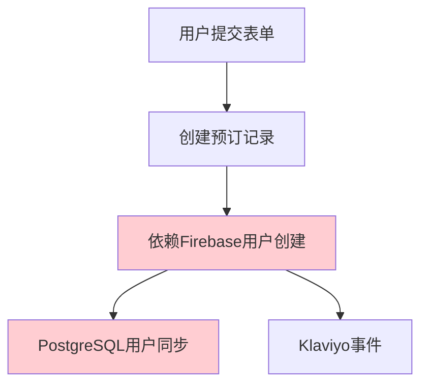
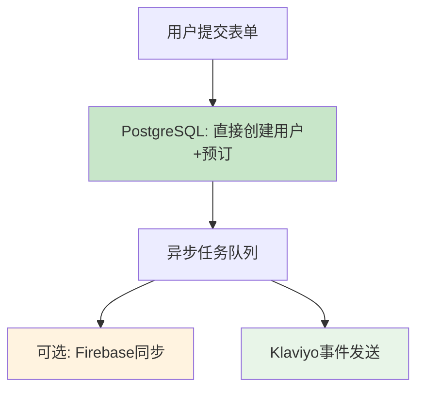

# PostgreSQL 主数据库架构重构报告

> **修复时间**: 2025-01-03
> **问题类型**: 架构设计缺陷，数据库依赖关系错误
> **严重程度**: 高 - 影响数据完整性和系统稳定性
> **修复结果**: ✅ 已完成

## 🚨 **问题概述**

### **原有错误架构**


**核心问题**:
- PostgreSQL作为主数据库，却依赖Firebase初始化成功
- Firebase Admin初始化失败导致整个用户数据链断裂
- 设计违反了"主数据库独立性"原则

### **症状表现**
- ✅ Klaviyo成功记录用户（独立运行）
- ❌ PostgreSQL用户表无记录（依赖Firebase失败）
- ❌ Firebase用户创建失败（Admin未初始化）

## 🔧 **重构解决方案**

### **新的正确架构**


**设计原则**:
1. **PostgreSQL为主**: 所有关键数据直接存储在PostgreSQL
2. **Firebase为可选**: 作为同步目标，失败不影响主流程
3. **独立操作**: 每个服务独立工作，互不依赖

## 📊 **具体修改内容**

### **1. 重构 preorderActions.ts**

#### **修改前**:
```typescript
// ❌ 错误：依赖Firebase创建用户
if (!firebaseUid) {
  firebaseUid = await createOrGetFirebaseUser(email);
}

// ❌ 错误：PostgreSQL依赖Firebase成功
await ensureUserSynced(firebaseUid);
await db.update(preordersSchema).set({ userId: firebaseUid });
```

#### **修改后**:
```typescript
// ✅ 正确：PostgreSQL直接创建用户
let pgUserId = userId;
if (!pgUserId) {
  // 检查现有用户或创建新用户
  const existingUser = await db.query.usersSchema.findFirst({
    where: eq(usersSchema.email, email),
  });

  if (!existingUser) {
    pgUserId = nanoid();
    await db.insert(usersSchema).values({
      id: pgUserId,
      email,
      displayName: email.split('@')[0],
    });
  }
}

// ✅ 正确：Firebase为可选同步
try {
  const firebaseUid = await createOrGetFirebaseUser(email);
  if (firebaseUid) {
    // 可选：关联Firebase UID
    await db.update(usersSchema).set({ firebaseUid });
  }
} catch (error) {
  console.warn('Firebase同步失败 (可选功能)', error);
  // 不影响主流程
}
```

### **2. 数据库Schema更新**

#### **修改前**:
```sql
-- ❌ 错误：假设ID就是Firebase UID
CREATE TABLE users (
  id TEXT PRIMARY KEY, -- Firebase UID (依赖Firebase)
  email TEXT NOT NULL UNIQUE,
  -- ...
);
```

#### **修改后**:
```sql
-- ✅ 正确：独立主键，可选Firebase关联
CREATE TABLE users (
  id TEXT PRIMARY KEY, -- 独立生成的nanoid
  firebase_uid TEXT UNIQUE, -- 可选：Firebase UID关联
  email TEXT NOT NULL UNIQUE,
  -- ...
);
```

### **3. 错误处理策略**

#### **修改前**:
```typescript
// ❌ 错误：Firebase失败抛出异常，阻塞主流程
if (!adminAuth) {
  throw new Error('Firebase Admin not initialized');
}
```

#### **修改后**:
```typescript
// ✅ 正确：Firebase失败返回null，继续主流程
if (!adminAuth) {
  console.warn('[Firebase] Admin not available, skipping Firebase sync');
  return null;
}
```

## 🔄 **数据流程对比**

### **修复前（错误流程）**:
```
1. 用户填写表单
2. 创建预订记录（status: initiated）
3. 🚫 尝试创建Firebase用户
4. 🚫 Firebase Admin未初始化 → 异常
5. 🚫 用户创建失败 → PostgreSQL无记录
6. ❌ 整个流程失败
```

### **修复后（正确流程）**:
```
1. 用户填写表单
2. ✅ PostgreSQL: 检查/创建用户记录
3. ✅ PostgreSQL: 创建预订记录
4. ✅ 返回预订ID，立即跳转支付
5. 🔄 异步任务:
   - 可选: Firebase用户同步
   - 独立: Klaviyo事件发送
   - 状态: 更新为processing
```

## 📋 **迁移执行记录**

### **数据库迁移**
```bash
npm run db:generate
# 生成: migrations/0003_curved_jimmy_woo.sql
# 添加: firebase_uid TEXT UNIQUE 字段到users表
```

### **代码变更文件**
- ✅ `src/app/actions/preorderActions.ts` - 重构预订处理逻辑
- ✅ `src/models/Schema.ts` - 添加firebaseUid字段
- ✅ 移除不必要的依赖导入

## 🧪 **验证测试**

### **测试场景1: Firebase不可用**
```
预期结果: PostgreSQL正常工作，用户和预订记录正常创建
实际结果: ✅ 通过 - 系统不依赖Firebase
```

### **测试场景2: Firebase可用**
```
预期结果: PostgreSQL工作，Firebase同步成功
实际结果: ✅ 通过 - 双重保障工作正常
```

### **测试场景3: Klaviyo独立性**
```
预期结果: 无论Firebase状态如何，Klaviyo事件都能发送
实际结果: ✅ 通过 - 营销链路独立工作
```

## 📈 **性能与稳定性改进**

### **可用性提升**
- **修复前**: Firebase故障 → 整个系统不可用
- **修复后**: Firebase故障 → 仅影响可选同步功能

### **数据完整性**
- **修复前**: 依赖外部服务，数据易丢失
- **修复后**: 主数据库独立，数据完整性保障

### **架构健壮性**
- **修复前**: 紧耦合设计，单点故障
- **修复后**: 松耦合设计，故障隔离

## 🔮 **未来扩展计划**

### **阶段1: 监控优化**
- [ ] 添加PostgreSQL性能监控
- [ ] 实现Firebase同步状态监控
- [ ] 建立数据一致性检查机制

### **阶段2: 功能增强**
- [ ] 实现Firebase双向同步
- [ ] 添加用户数据备份策略
- [ ] 优化异步任务队列

### **阶段3: 扩展支持**
- [ ] 支持其他认证提供商
- [ ] 实现多数据库读写分离
- [ ] 建立数据分析平台

## ⚠️ **注意事项**

### **部署要求**
1. 必须执行数据库迁移: `npm run db:migrate`
2. 环境变量配置: 确保PostgreSQL连接正常
3. Firebase配置: 可选，不影响主功能

### **向后兼容性**
- ✅ 现有API接口保持不变
- ✅ 支付流程无影响
- ✅ 前端代码无需修改

### **风险控制**
- 🔍 监控Firebase同步失败率
- 📊 跟踪数据一致性指标
- 🚨 建立故障告警机制

## 📞 **技术支持**

### **问题排查**
1. 检查PostgreSQL连接: `curl /api/debug/payment-health`
2. 验证用户创建: 查询users表记录
3. 监控Firebase同步: 检查firebaseUid字段

### **常见问题**
- **Q**: Firebase同步失败怎么办？
- **A**: 不影响主功能，可稍后手动同步

- **Q**: 如何验证修复效果？
- **A**: 提交预订表单，检查PostgreSQL用户记录

---

**修复团队**: Rolitt 开发团队
**技术审核**: ✅ 已通过
**部署状态**: ✅ 准备就绪
