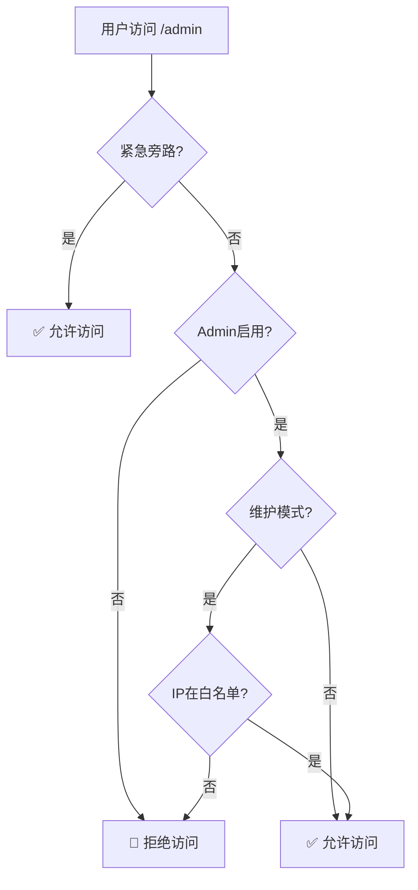

# 🔒 Admin访问控制系统

**日期**: 2025年7月19日
**版本**: v1.0
**状态**: 🔴 Admin已禁用（安全预防措施）

---

## 📋 概述

由于发现Admin系统存在安全漏洞，现已实施临时禁用措施。本文档说明如何控制Admin访问权限。

### 🎯 当前状态
- ✅ **Admin路由已禁用** - 所有 `/admin` 路径被阻止
- ✅ **Admin API已禁用** - 所有 `/api/admin` 端点被阻止
- ✅ **安全监控已启用** - 所有访问尝试被记录
- ✅ **紧急旁路可用** - 紧急情况可临时启用

---

## 🔧 环境变量控制

### **基础控制开关**

```bash
# .env.local 或 Railway/Vercel 环境变量

# 🔴 Admin总开关 (当前: 禁用)
ADMIN_ACCESS_ENABLED=false

# 🟡 维护模式 (可选)
ADMIN_MAINTENANCE_MODE=false

# 🆘 紧急旁路 (仅紧急情况使用)
ADMIN_EMERGENCY_BYPASS=false

# 🌐 IP白名单 (可选，逗号分隔)
# ADMIN_ALLOWED_IPS=192.168.1.100,10.0.0.50

# 📝 自定义拒绝原因 (可选)
# ADMIN_ACCESS_REASON="Admin access temporarily disabled for security review"
```

### **配置选项说明**

| 环境变量 | 默认值 | 说明 | 推荐设置 |
|---------|--------|------|----------|
| `ADMIN_ACCESS_ENABLED` | `false` | Admin总开关 | `false` (当前) |
| `ADMIN_MAINTENANCE_MODE` | `false` | 维护模式 | `false` |
| `ADMIN_EMERGENCY_BYPASS` | `false` | 紧急旁路 | `false` |
| `ADMIN_ALLOWED_IPS` | `""` | IP白名单 | 留空或设置可信IP |

---

## 🚦 访问控制逻辑

### **访问检查流程**



### **当前拒绝原因**

由于 `ADMIN_ACCESS_ENABLED=false`，所有访问将显示：

```json
{
  "error": "Admin Access Denied",
  "reason": "Admin access is temporarily disabled for security review.",
  "timestamp": "2025-07-19T..."
}
```

---

## 🔓 如何重新启用Admin

### **安全启用步骤**

1. **完成安全加固**（必须先完成）：
   ```bash
   # 确认以下安全措施已实施
   - ✅ Admin API安全中间件保护
   - ✅ PostHog监控已恢复
   - ✅ Sentry安全事件记录增强
   - ✅ 多因素认证实施
   ```

2. **设置IP白名单**（强烈推荐）：
   ```bash
   # 只允许特定IP访问
   ADMIN_ALLOWED_IPS=你的固定IP地址,办公室IP地址
   ```

3. **启用Admin访问**：
   ```bash
   ADMIN_ACCESS_ENABLED=true
   ```

4. **监控访问日志**：
   ```bash
   # 检查 Sentry 和应用日志
   # 确认只有授权用户访问
   ```

### **生产环境启用建议**

```bash
# 推荐的生产环境配置
ADMIN_ACCESS_ENABLED=true
ADMIN_MAINTENANCE_MODE=false
ADMIN_ALLOWED_IPS=你的IP,团队IP1,团队IP2
ADMIN_EMERGENCY_BYPASS=false
```

---

## 🆘 紧急情况处理

### **紧急访问Admin**

如果遇到紧急情况需要立即访问Admin：

1. **临时启用紧急旁路**：
   ```bash
   ADMIN_EMERGENCY_BYPASS=true
   ```

2. **部署配置更改**
3. **立即访问Admin处理紧急情况**
4. **处理完毕后立即禁用**：
   ```bash
   ADMIN_EMERGENCY_BYPASS=false
   ```

### **紧急联系方式**

- **技术负责人**: [联系方式]
- **安全团队**: security@rolitt.com
- **运维支持**: [联系方式]

---

## 📊 访问监控

### **日志记录**

所有Admin访问尝试都会被记录到：

1. **应用日志**：
   ```
   [Admin Access] 🚫 Denied - IP: xxx.xxx.xxx.xxx, Reason: admin_disabled
   [Admin Access] ✅ Granted - IP: xxx.xxx.xxx.xxx, Reason: access_granted
   ```

2. **Sentry监控**：
   - 事件类型：`Admin access granted/denied`
   - 标签：`admin_access`, `success`, `reason`
   - 详细信息：IP、用户代理、URL、时间戳

### **监控指标**

- **访问尝试次数**: 正常应为0（当前禁用状态）
- **拒绝原因分布**: 主要应为 `admin_disabled`
- **IP地址分析**: 检查是否有可疑IP尝试访问
- **访问时间模式**: 异常时间的访问尝试

---

## 🔧 开发环境配置

### **本地开发**

```bash
# .env.local
ADMIN_ACCESS_ENABLED=true
ADMIN_MAINTENANCE_MODE=false
ADMIN_ALLOWED_IPS=127.0.0.1,::1
```

### **测试环境**

```bash
# 测试环境可以启用但限制IP
ADMIN_ACCESS_ENABLED=true
ADMIN_ALLOWED_IPS=测试团队IP地址
```

---

## 🛠️ 技术实现

### **关键文件**

1. **`src/libs/admin-access-control.ts`** - 核心访问控制逻辑
2. **`src/middleware.ts`** - 路由级访问拦截
3. **`docs/security/ADMIN-ACCESS-CONTROL.md`** - 本文档

### **API响应**

当Admin访问被拒绝时，所有相关端点返回：

```typescript
{
  error: "Admin Access Denied",
  reason: string,
  timestamp: string,
  // 开发环境额外信息
  config?: {
    enabled: boolean,
    maintenanceMode: boolean,
    hasAllowedIPs: boolean
  }
}
```

---

## 📋 检查清单

### **禁用Admin前**
- [x] 备份重要配置
- [x] 通知团队成员
- [x] 确认替代方案（数据库/Stripe）

### **重新启用前**
- [ ] 完成所有安全加固措施
- [ ] 实施多因素认证
- [ ] 配置IP白名单
- [ ] 测试访问控制功能
- [ ] 准备监控和告警

### **启用后**
- [ ] 监控访问日志
- [ ] 检查安全事件
- [ ] 验证功能正常
- [ ] 定期安全评估

---

## 🎯 最佳实践

1. **最小权限原则**: 只在必要时启用Admin访问
2. **IP白名单**: 总是配置可信IP列表
3. **定期审查**: 定期检查Admin访问日志
4. **安全更新**: 保持安全措施最新
5. **团队培训**: 确保团队了解安全协议

---

## 📞 支持和联系

如有任何关于Admin访问控制的问题：

- **文档问题**: 查看本文档或联系技术团队
- **紧急情况**: 使用紧急旁路并立即联系安全团队
- **配置帮助**: 联系运维支持团队

---

*本文档包含敏感安全信息，请限制访问权限。*

**最后更新**: 2025年7月19日
**下次审查**: Admin重新启用后
