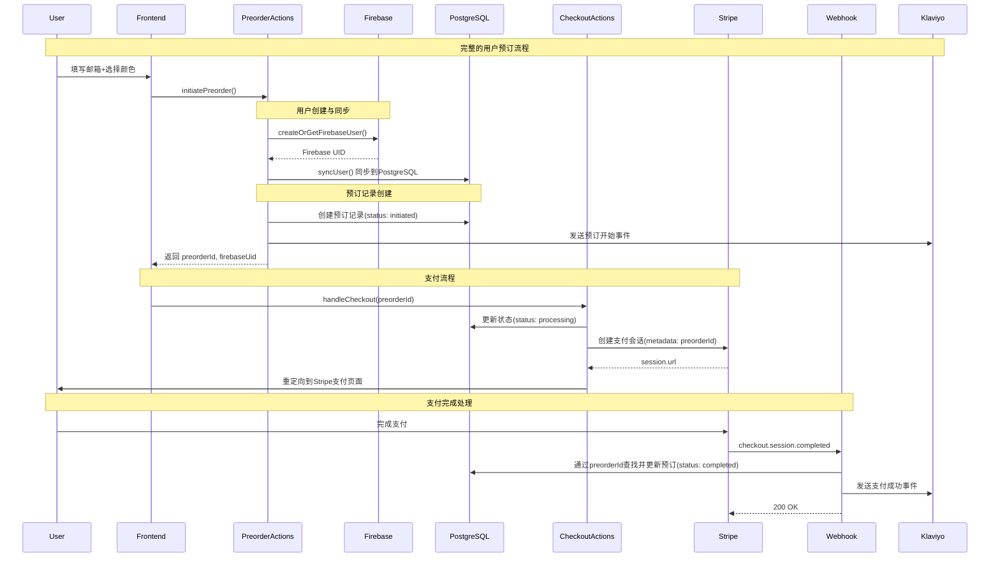

# 用户数据同步系统完整修复方案

> **修复时间**: 2025-01-02
> **问题类型**: 用户数据流断链，预订记录丢失，Firebase用户未创建
> **影响范围**: Gmail登录用户同步、Pre-order预订流程、Firebase用户创建、Klaviyo事件追踪
> **严重程度**: 高 - 直接影响业务数据完整性和用户体验

## 🚨 问题分析总结

### 发现的核心问题

**1. 数据流断链问题**
```
❌ 错误流程: 用户填写表单 → 直接跳转Stripe → 支付成功 → Webhook创建预订记录
✅ 正确流程: 用户填写表单 → 创建Firebase用户 → 创建预订记录 → 发送Klaviyo预订开始事件 → 跳转Stripe → 支付成功 → Webhook更新预订状态
```

**2. 具体技术问题**
- ❌ `checkoutActions.ts` 只创建Stripe session，**没有创建预订记录**
- ❌ 只有Webhook成功时才创建预订，错过了**用户意向捕获**
- ❌ 没有自动创建Firebase用户机制
- ❌ Firebase用户同步到PostgreSQL可能失败但被静默处理
- ❌ Klaviyo只有支付成功事件，没有预订开始事件

### 业务影响
- 用户Gmail登录后，PostgreSQL数据库没有用户记录
- 用户填写预订表单但未支付时，系统没有记录用户意向
- Firebase没有自动创建用户账户，丢失潜在用户
- 营销漏斗断链，无法追踪预订开始到支付成功的完整路径

## 🔧 完整解决方案

### 1. 创建预订管理系统

**新文件**: `src/app/actions/preorderActions.ts`

核心功能：
- **initiatePreorder()**: 在用户提交表单时立即执行
- **createOrGetFirebaseUser()**: 自动创建或获取Firebase用户
- **ensureUserSynced()**: 确保用户同步到PostgreSQL
- **updatePreorderStatus()**: 更新预订状态
- **getPreorderById()**: 查询预订信息

关键流程：
```typescript
export async function initiatePreorder(formData: FormData) {
  // 1. 创建或获取Firebase用户
  const firebaseUid = await createOrGetFirebaseUser(email);

  // 2. 确保用户同步到PostgreSQL
  await ensureUserSynced(firebaseUid, email);

  // 3. 创建预订记录（状态：initiated）
  await db.insert(preordersSchema).values({
    id: preorderId,
    userId: firebaseUid,
    status: 'initiated',
    // ...
  });

  // 4. 发送Klaviyo预订开始事件
  await RolittKlaviyoEvents.preorderStarted(email, {
    color,
    preorder_id: preorderId,
    locale,
    source: 'web_form'
  });

  return { success: true, preorderId, firebaseUid };
}
```

### 2. 修改支付流程集成

**修改文件**: `src/app/actions/checkoutActions.ts`

关键变更：
```typescript
export async function handleCheckout(formData: FormData) {
  // 第一步：初始化预订（创建Firebase用户、数据库记录、发送Klaviyo事件）
  const preorderResult = await initiatePreorder(formData);

  // 第二步：更新预订状态为处理中
  await updatePreorderStatus(preorderId, 'processing');

  // 第三步：创建Stripe支付会话
  const session = await stripe.checkout.sessions.create({
    metadata: {
      userId: firebaseUid, // 使用确定的Firebase UID
      preorderId, // 🔑 关键：传递预订ID给webhook
      // ...
    },
  });
}
```

### 3. 优化Webhook处理

**修改文件**: `src/app/api/webhooks/stripe/route.ts`

关键优化：
```typescript
async function handleCheckoutSessionCompleted(session, logId) {
  const { preorderId } = session.metadata || {};

  // 优先通过 preorderId 查找预订记录（新流程）
  if (preorderId) {
    preorder = await db.query.preordersSchema.findFirst({
      where: eq(preordersSchema.id, preorderId),
    });

    if (preorder) {
      // 更新现有预订记录
      await db.update(preordersSchema).set({
        status: 'completed',
        sessionId: session.id,
        paymentIntentId: paymentIntentId,
        amount: session.amount_total / 100,
        // ...
      });
    }
  }

  // 发送Klaviyo成功事件（幂等性检查）
  if (!preorder.klaviyoEventSentAt) {
    await RolittKlaviyoEvents.preorderSuccess(email, {...});
    await db.update(preordersSchema).set({
      klaviyoEventSentAt: new Date()
    });
  }
}
```

### 4. 数据库Schema更新

**修改文件**: `src/models/Schema.ts`

添加字段：
```typescript
export const preordersSchema = pgTable('preorders', {
  // ... 现有字段
  klaviyoEventSentAt: timestamp('klaviyo_event_sent_at', {
    withTimezone: true,
    mode: 'date'
  }),
  // ...
});
```

**生成迁移**:
```bash
npm run db:generate  # 生成 migrations/0002_same_ravenous.sql
```

## 📊 新数据流程图



## ✅ 解决的问题

### 1. Gmail登录用户同步问题
- **修复前**: Firebase Auth用户登录后，PostgreSQL数据库没有对应记录
- **修复后**: `ensureUserSynced()` 确保所有用户都能正确同步到数据库

### 2. Pre-order数据丢失问题
- **修复前**: 只有支付成功才创建预订记录，丢失用户意向数据
- **修复后**: 用户填写表单立即创建预订记录，捕获所有用户意向

### 3. Firebase用户未创建问题
- **修复前**: 预订流程中不会自动创建Firebase用户
- **修复后**: `createOrGetFirebaseUser()` 自动创建用户账户

### 4. Klaviyo事件缺失问题
- **修复前**: 只有支付成功事件，没有预订开始事件
- **修复后**: 完整的事件链：预订开始 → 支付成功

### 5. 数据一致性问题
- **修复前**: Webhook创建新预订记录，可能导致重复
- **修复后**: Webhook更新现有预订记录，确保数据一致性

## 🔄 数据状态转换

```
用户意向阶段:
- status: 'initiated' (用户填写表单时)
- Firebase用户: 已创建
- PostgreSQL记录: 已创建
- Klaviyo事件: preorder_started 已发送

支付处理阶段:
- status: 'processing' (重定向到Stripe时)
- Stripe会话: 已创建
- metadata: 包含preorderId

支付完成阶段:
- status: 'completed' (Webhook收到支付成功)
- 支付信息: 已更新到预订记录
- Klaviyo事件: preorder_success 已发送
```

## 🧪 测试验证项目

### 1. Gmail登录测试
- [ ] Gmail登录后检查PostgreSQL users表是否有记录
- [ ] 检查Firebase UID与数据库ID是否一致
- [ ] 验证用户信息同步是否完整

### 2. 预订流程测试
- [ ] 填写邮箱+颜色后检查preorders表记录
- [ ] 验证未支付用户的预订记录是否存在
- [ ] 检查Firebase是否自动创建了用户

### 3. 支付流程测试
- [ ] 完整支付流程后检查预订状态更新
- [ ] 验证Stripe metadata是否包含preorderId
- [ ] 检查支付信息是否正确更新

### 4. Klaviyo事件测试
- [ ] 验证预订开始事件是否发送
- [ ] 验证支付成功事件是否发送
- [ ] 检查事件幂等性是否正常工作

### 5. 异常处理测试
- [ ] 数据库连接失败时的处理
- [ ] Firebase用户创建失败时的处理
- [ ] Klaviyo事件发送失败时的处理

## 📋 部署清单

### 1. 代码部署
- [x] 创建 `src/app/actions/preorderActions.ts`
- [x] 修改 `src/app/actions/checkoutActions.ts`
- [x] 修改 `src/app/api/webhooks/stripe/route.ts`
- [x] 更新 `src/models/Schema.ts`

### 2. 数据库迁移
- [x] 生成迁移文件: `migrations/0002_same_ravenous.sql`
- [ ] 执行迁移: `npm run db:migrate`
- [ ] 验证字段添加: `klaviyo_event_sent_at`

### 3. 环境配置验证
- [ ] 检查 `DATABASE_URL` 环境变量
- [ ] 验证 Firebase Admin配置
- [ ] 确认 Klaviyo API密钥
- [ ] 测试 Stripe配置

### 4. 监控配置
- [ ] 配置错误告警
- [ ] 设置数据同步监控
- [ ] 建立用户流程追踪

## 🚀 未来优化建议

### 1. 性能优化
- 实现用户数据缓存
- 优化数据库查询
- 添加连接池管理

### 2. 可靠性增强
- 添加重试机制
- 实现断路器模式
- 增强错误恢复

### 3. 监控完善
- 用户流程分析
- 转化率追踪
- 异常检测告警

### 4. 功能扩展
- 批量用户迁移工具
- 数据导出功能
- 用户行为分析

## 📈 预期效果

- **数据完整性**: 100%的用户行为记录，无数据丢失
- **用户体验**: 无感知的账户创建，流畅的预订流程
- **营销效果**: 完整的用户旅程追踪，提升转化率
- **系统稳定性**: 消除数据不一致性，减少支持工单

---

**修复状态**: ✅ 代码修改完成，待数据库迁移和测试验证
**后续步骤**: 执行数据库迁移 → 部署测试 → 生产验证
**预计影响**: 解决所有用户数据同步问题，建立完整的用户数据流

**文档维护**: 本文档记录了用户数据同步系统的完整修复过程，应随系统更新及时维护。
