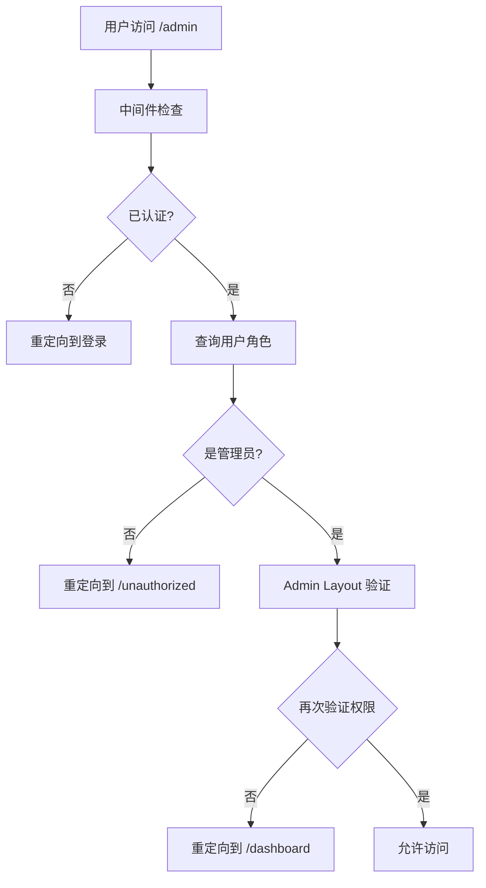

# 管理员权限系统完整实现

**时间**: 2025-07-09
**类型**: 权限系统实现
**影响范围**: 全站权限控制

## 📋 实现概述

本次实现了完整的基于角色的访问控制 (RBAC) 系统，确保只有管理员用户才能访问 `/admin` 路由。

## 🔧 实现的功能

### 1. 用户角色查询函数 (`src/app/actions/userActions.ts`)

```typescript
// 新增函数
export async function getUserRole(userId: string);
export async function isUserAdmin(userId: string);
```

**功能**:
- 根据 Firebase UID 查询数据库中的用户角色
- 检查用户是否为管理员
- 错误处理和类型安全

### 2. 会话验证 API 增强 (`src/app/api/auth/verify-session/route.ts`)

**新增返回字段**:
```json
{
  "isAuthenticated": true,
  "uid": "firebase-uid",
  "role": "admin",
  "isAdmin": true
}
```

**改进**:
- 验证会话时同时查询用户角色
- 返回完整的权限信息
- 默认角色为 `customer`

### 3. 中间件权限检查 (`src/middleware.ts`)

**新增功能**:
- 区分普通保护路由和管理员专用路由
- 检查用户角色权限
- 无权限用户重定向到 `/unauthorized`

```typescript
const protectedRoutes = ['/dashboard', '/admin'];
const adminOnlyRoutes = ['/admin'];
```

### 4. Admin Layout 权限验证 (`src/app/[locale]/admin/layout.tsx`)

**实现**:
- 服务器端权限验证
- 直接重定向无权限用户
- 双重保护机制

```typescript
async function verifyAdminAccess(): Promise<boolean>;
```

### 5. 无权限页面 (`src/app/[locale]/unauthorized/page.tsx`)

**功能**:
- 友好的无权限提示页面
- 多语言支持
- 导航选项（返回 Dashboard 或首页）

### 6. 多语言支持

**新增翻译文件**:
- `src/locales/en/unauthorized.json`
- `src/locales/zh-HK/unauthorized.json`
- `src/locales/es/unauthorized.json`
- `src/locales/ja/unauthorized.json`

## 🔐 权限层级

| 角色 | Dashboard 访问 | Admin 访问 | 描述 |
|------|---------------|------------|------|
| `customer` | ✅ | ❌ | 普通用户，只能访问个人面板 |
| `admin` | ✅ | ✅ | 管理员，拥有完整权限 |
| `moderator` | ✅ | ❌ | 版主，未来可扩展部分管理权限 |

## 🛡️ 安全机制

### 多层防护
1. **中间件层**: 路由级别的权限检查
2. **Layout 层**: 服务器组件权限验证
3. **API 层**: 会话和角色验证
4. **数据库层**: 角色数据持久化

### 错误处理
- 数据库查询失败时默认为 `customer` 角色
- 权限验证失败时安全重定向
- 详细的错误日志记录

## 📝 使用说明

### 修改用户角色

使用现有脚本修改用户角色：

```bash
npx tsx scripts/update-user-role.ts aviva.mar@gmail.com admin
```

### 验证权限

1. 确保用户已登录系统（数据库中存在记录）
2. 使用脚本修改角色为 `admin`
3. 用户重新登录以获取新权限
4. 访问 `/admin` 路由验证权限

## 🔄 权限流程



## ⚠️ 注意事项

1. **用户同步**: 用户首次登录时会自动同步到数据库，默认角色为 `customer`
2. **权限生效**: 角色修改后，用户需要重新登录才能获得新权限
3. **数据库一致性**: 确保 `users` 表中的 `role` 字段与实际权限需求一致
4. **安全性**: 所有权限检查都在服务器端进行，客户端无法绕过

## 🚀 后续优化

1. **细粒度权限**: 可以基于当前架构扩展更细粒度的权限控制
2. **权限缓存**: 考虑添加权限信息缓存以提高性能
3. **审计日志**: 添加权限变更和访问的审计日志
4. **权限管理界面**: 在管理员面板中添加用户权限管理功能

## ✅ 测试清单

- [ ] 普通用户无法访问 `/admin`
- [ ] 管理员用户可以正常访问 `/admin`
- [ ] 无权限页面正确显示
- [ ] 多语言翻译正确
- [ ] 权限修改脚本正常工作
- [ ] 中间件正确重定向
- [ ] Layout 权限验证有效

---

**实现状态**: ✅ 完成
**测试状态**: 🔄 待测试
**部署状态**: 🔄 待部署
