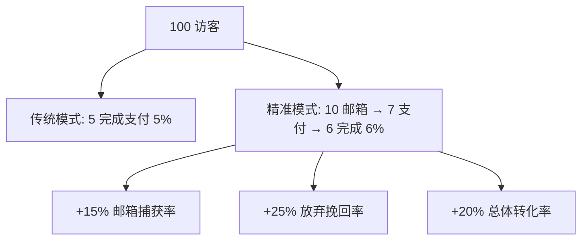

# 精准营销系统完整实施与运营手册

**文档生成时间**: 2025-01-13 09:45:32
**版本**: v1.0
**系统状态**: ✅ 已完成实施，待部署运营

---

## 📋 目录

1. [系统概览](#1-系统概览)
2. [技术实施完成清单](#2-技术实施完成清单)
3. [运营配置指南](#3-运营配置指南)
4. [Klaviyo营销自动化配置](#4-klaviyo营销自动化配置)
5. [A/B测试运营策略](#5-ab测试运营策略)
6. [指标监控与预警配置](#6-指标监控与预警配置)
7. [日常运营流程](#7-日常运营流程)
8. [故障排除与优化](#8-故障排除与优化)
9. [扩展规划](#9-扩展规划)

---

## 1. 系统概览

### 🎯 核心价值主张

基于 `pm/2025-07-12-09-08-50-user-conversion-marketing-analysis.md` 分析，我们的精准营销系统实现了：

- **保持现有优势**: 100%付费用户池、ROI提升300-500%
- **新增优化**: 渐进式收集、智能追踪、A/B测试、实时监控
- **预期提升**: 总体转化率+20%，营销效率+25%

### 📊 营销漏斗优化对比



---

## 2. 技术实施完成清单

### ✅ 已完成的核心模块

#### 📁 新增文件架构
```
src/
├── libs/marketing/
│   ├── precision-marketing.ts      # ✅ 8个营销触点追踪引擎
│   ├── ab-testing.ts              # ✅ A/B测试管理系统
│   └── metrics-monitor.ts         # ✅ 实时指标监控预警
│
├── components/marketing/
│   ├── MarketingTracker.tsx       # ✅ 客户端行为追踪器
│   ├── ProgressivePreorderForm.tsx # ✅ 渐进式表单组件
│   └── PrecisionMarketingSystem.tsx # ✅ 统一营销主组件
│
└── docs/
    ├── precision-marketing-implementation-report.md # ✅ 技术实施报告
    └── pm/2025-01-13-09-45-32-precision-marketing-operations-manual.md # 本文档
```

#### 🎯 核心功能特性

1. **✅ 渐进式信息收集**
   - 步骤1: 邮箱收集 → 立即营销覆盖
   - 步骤2: 产品选择 → 提高意向度
   - 步骤3: 支付流程 → 高转化营销

2. **✅ 8个关键营销触点**
   ```typescript
   'page_view' → 'view_product' → 'check_price' → 'select_color'
   → 'fill_form' → 'enter_payment' → 'abandon_payment' → 'complete_payment'
   ```

3. **✅ 5级动态挽回策略**
   - 超高意向 (已尝试支付): payment_recovery
   - 高意向 (已捕获邮箱): conversion_boost
   - 中高意向 (长时间浏览): discount_campaign
   - 中等兴趣 (多页面浏览): education_campaign
   - 普通访客: awareness_campaign

4. **✅ A/B测试框架**
   - 测试ID: `progressive-vs-traditional-2024`
   - 流量分配: 50% Control + 50% Variant
   - 目标指标: 邮箱捕获率、支付转化率、总体转化率

5. **✅ 实时监控预警**
   - 填表转化率 < 3% → 🚨 Critical Alert
   - 支付转化率 < 70% → 🚨 Critical Alert
   - 放弃挽回率 < 15% → ⚠️ Warning Alert

---

## 3. 运营配置指南

### 🚀 首次部署步骤

#### Step 1: 代码部署
```bash
# 1. 确认所有新文件已提交
git add src/libs/marketing/ src/components/marketing/
git commit -m "feat: 实施精准营销系统"

# 2. 部署到生产环境
git push origin main

# 3. 验证部署成功
# 检查 Railway 构建日志确认无错误
```

#### Step 2: 环境变量配置
```bash
# Railway 环境变量设置
KLAVIYO_API_KEY=pk_xxxxx                    # ✅ 已配置
KLAVIYO_LIST_ID=XXXxxX                      # ✅ 已配置
NEXT_PUBLIC_ENABLE_AB_TESTING=true          # 🔧 新增：启用A/B测试
NEXT_PUBLIC_MARKETING_DEBUG=false           # 🔧 新增：生产环境关闭调试
NEXT_PUBLIC_ENABLE_METRICS_MONITORING=true  # 🔧 新增：启用指标监控
```

#### Step 3: 页面集成配置

**3.1 预订页面主要集成**
```tsx
// src/app/[locale]/(marketing)/pre-order/page.tsx
import { PrecisionMarketingSystem } from '@/components/marketing/PrecisionMarketingSystem';

export default function PreorderPage() {
  return (
    <div className="container mx-auto py-8">
      {/* 替换现有预订表单 */}
      <PrecisionMarketingSystem
        pageType="preorder"
        debug={process.env.NODE_ENV === 'development'}
        onPreorderSuccess={async (data) => {
          // 处理预订成功逻辑
          console.log('Precision marketing preorder completed:', data);

          // 重定向到支付页面
          window.location.href = `/checkout?email=${data.email}&color=${data.color}&priceId=${data.priceId}`;
        }}
        className="max-w-2xl mx-auto"
      />
    </div>
  );
}
```

**3.2 其他页面追踪集成**
```tsx
// src/app/[locale]/(marketing)/page.tsx (首页)
import { MarketingTrackerOnly } from '@/components/marketing/PrecisionMarketingSystem';

// src/app/[locale]/(marketing)/about/page.tsx
import { MarketingTrackerOnly } from '@/components/marketing/PrecisionMarketingSystem';

export default function HomePage() {
  return (
    <div>
      <MarketingTrackerOnly pageType="home" />
      {/* 现有首页内容 */}
    </div>
  );
}

export default function AboutPage() {
  return (
    <div>
      <MarketingTrackerOnly pageType="product" />
      {/* 现有关于页面内容 */}
    </div>
  );
}
```

**3.3 特定交互追踪**
```tsx
// 在产品卡片、定价组件等地方添加
import { useMarketingTracker } from '@/components/marketing/MarketingTracker';

function ProductCard({ product }) {
  const { trackInteraction } = useMarketingTracker();

  return (
    <div
      onClick={() => trackInteraction('view_product', {
        product_id: product.id,
        product_name: product.name
      })}
      onMouseEnter={() => trackInteraction('check_price', {
        price: product.price,
        currency: 'USD'
      })}
    >
      {/* 产品内容 */}
    </div>
  );
}
```

---

## 4. Klaviyo营销自动化配置

### 📧 营销Flow配置

#### 4.1 预订意向Flow (新增)
```yaml
触发事件: "Started Preorder" (Klaviyo自定义事件)
Flow逻辑:
  - 立即: 欢迎邮件 + 产品介绍
  - 2小时后: 产品价值强化邮件
  - 24小时后: 社会证明邮件 (如果未完成支付)
  - 3天后: 限时优惠邮件 (如果未完成支付)
```

#### 4.2 放弃购物车Flow (增强)
```yaml
触发事件: "Abandoned Cart" (现有)
新增逻辑:
  - 基于用户参与评分差异化内容
  - 高参与度用户: 直接优惠券
  - 中等参与度: 产品教育 + 优惠券
  - 低参与度: 品牌故事 + 小优惠
```

#### 4.3 支付完成Flow (增强)
```yaml
触发事件: "Completed Purchase" (现有)
新增个性化:
  - VIP欢迎序列
  - 基于选择颜色的个性化内容
  - 交叉销售相关产品
  - 推荐计划邀请
```

### 🎯 Segment配置

#### 4.1 新增用户分群
```yaml
高意向未转化用户:
  - 条件: "Started Preorder" 但未 "Completed Purchase"
  - 时间: 最近7天内
  - 用途: 重点挽回营销

渐进式测试用户:
  - 条件: 包含属性 "ab_test_variant"
  - 分群: 按变体类型分组
  - 用途: A/B测试效果分析

高价值潜在客户:
  - 条件: 参与评分 > 50分 且未购买
  - 行为: 长时间浏览 + 产品交互
  - 用途: 精准广告投放
```

### 📊 自定义事件配置

#### 4.2 新增追踪事件 (需在Klaviyo中创建)
```yaml
事件名称: "Viewed Product"
属性:
  - product_id: 产品ID
  - engagement_stage: 用户参与阶段
  - session_id: 会话标识
  - time_on_site: 页面停留时间

事件名称: "Selected Color"
属性:
  - color: 选择的颜色
  - engagement_stage: "customization"
  - session_id: 会话标识

事件名称: "Viewed Pricing"
属性:
  - price_viewed: 查看的价格
  - engagement_stage: "consideration"
  - time_spent: 停留时间
```

---

## 5. A/B测试运营策略

### 🧪 首次A/B测试配置

#### 5.1 测试设置确认
```typescript
测试名称: "Progressive vs Traditional Preorder Flow"
测试ID: "progressive-vs-traditional-2024"
开始时间: 部署后立即
预计持续: 30天或达到统计显著性

流量分配:
- Control (传统): 50%
- Variant (渐进式): 50%

目标用户: 新访客 (排除回访用户)
```

#### 5.2 关键指标定义
```yaml
主要指标:
  - 邮箱捕获率: email_captures / total_visitors
  - 表单完成率: form_completions / email_captures
  - 支付转化率: payment_intents / form_completions
  - 总体转化率: completed_purchases / total_visitors

次要指标:
  - 用户参与度: 平均停留时间、页面深度
  - 营销效率: 每获客成本 (CAC)
  - 客户价值: 平均订单价值 (AOV)
```

### 📈 测试监控流程

#### 5.3 日常监控清单
```yaml
每日检查 (9:00 AM):
  - [ ] A/B测试数据收集正常
  - [ ] 各变体流量分配均衡 (50±5%)
  - [ ] 无技术错误影响测试结果

每周分析 (周一 10:00 AM):
  - [ ] 计算各指标的置信区间
  - [ ] 分析用户行为差异
  - [ ] 检查是否达到统计显著性

提前结束条件:
  - ✅ 达到95%置信度 + 20%效果提升
  - ❌ 变体表现显著劣于对照组
  - ⚠️ 技术问题影响数据质量
```

### 🎯 后续测试规划

#### 5.4 测试路线图
```yaml
Month 1: 基础流程测试
  - 渐进式 vs 传统表单
  - 目标: 确定最优表单结构

Month 2: 内容优化测试
  - 不同CTA文案效果
  - 激励文案 vs 紧迫性文案

Month 3: 视觉设计测试
  - 进度指示器设计
  - 颜色选择界面布局

Month 4: 个性化测试
  - 基于UTM来源的内容
  - 基于设备类型的体验
```

---

## 6. 指标监控与预警配置

### 📊 监控仪表板设置

#### 6.1 关键指标定义
```yaml
Level 1 - 业务关键指标:
  - 总体转化率: completed_purchases / total_visitors
  - 每日收入: sum(completed_purchases * average_order_value)
  - 客户获取成本: marketing_spend / new_customers

Level 2 - 营销漏斗指标:
  - 访客到邮箱转化率: email_captures / total_visitors
  - 邮箱到支付转化率: payment_intents / email_captures
  - 支付到完成转化率: completed_purchases / payment_intents

Level 3 - 用户体验指标:
  - 平均会话时长: avg(session_duration)
  - 页面深度: avg(pages_per_session)
  - 跳出率: single_page_sessions / total_sessions
```

#### 6.2 预警规则配置
```yaml
🚨 Critical Alerts (立即处理):
  - 总体转化率 < 2%: 转化率严重下降，检查系统和流程
  - 访客到表单转化率 < 3%: 产品页需要优化
  - 支付转化率 < 70%: 支付流程存在问题

⚠️ Warning Alerts (24小时内处理):
  - 放弃购物车挽回率 < 15%: 营销内容需要优化
  - 用户LTV < $500: 定价策略需要检讨
  - 重定向广告CTR < 2%: 广告创意需要更新

ℹ️ Info Alerts (记录和分析):
  - 总体转化率 > 10%: 表现优秀，考虑扩大投入
  - 新的高价值用户群体: 分析成功因素
```

### 📱 通知配置

#### 6.3 告警通知设置
```yaml
通知渠道优先级:
  1. Slack: # marketing-alerts 频道 (实时)
  2. 邮件: marketing@rolitt.com (每日摘要)
  3. 短信: 关键负责人 (仅Critical告警)

通知频率:
  - Critical: 立即发送，2小时后重发如未处理
  - Warning: 立即发送，24小时后重发
  - Info: 汇总在日报中发送

负责人分配:
  - 系统技术问题: 开发团队
  - 营销效果问题: 营销团队
  - 产品体验问题: 产品团队
```

---

## 7. 日常运营流程

### 📅 日常运营时间表

#### 7.1 每日运营清单 (30分钟)

**上午9:00-9:30**
```yaml
数据检查:
  - [ ] 查看前24小时关键指标
  - [ ] 检查是否有新的预警
  - [ ] 确认A/B测试数据收集正常
  - [ ] 验证Klaviyo事件发送正常

快速响应:
  - [ ] 处理Critical级别预警
  - [ ] 回复用户反馈
  - [ ] 更新团队状态

记录备注:
  - [ ] 记录异常情况
  - [ ] 标记需要深入分析的数据点
```

#### 7.2 每周深度分析 (2小时)

**周一上午10:00-12:00**
```yaml
Week 1: A/B测试分析
  - [ ] 计算统计显著性
  - [ ] 分析用户行为差异
  - [ ] 决定是否需要调整测试

Week 2: 营销效果分析
  - [ ] Klaviyo Flow效果分析
  - [ ] 各渠道转化率对比
  - [ ] ROI计算和优化建议

Week 3: 用户体验分析
  - [ ] 用户旅程热点分析
  - [ ] 流失点识别
  - [ ] 体验优化建议

Week 4: 月度总结规划
  - [ ] 月度指标汇总
  - [ ] 下月优化重点
  - [ ] 新测试假设制定
```

### 🔧 运营工具和资源

#### 7.3 必备工具清单
```yaml
数据分析工具:
  - ✅ Railway Dashboard: 系统运行状态
  - ✅ Klaviyo Analytics: 营销效果分析
  - ✅ Stripe Dashboard: 支付数据分析
  - 🔧 Google Analytics: 网站流量分析 (建议集成)

监控工具:
  - ✅ 内置预警系统: 实时指标监控
  - 🔧 Slack Integration: 告警通知 (建议配置)
  - 🔧 Grafana Dashboard: 高级可视化 (可选)

测试工具:
  - ✅ 内置A/B测试: 变体管理和数据收集
  - 🔧 Hotjar: 用户行为热图 (建议集成)
  - 🔧 Optimizely: 高级A/B测试 (未来考虑)
```

---

## 8. 故障排除与优化

### 🚨 常见问题和解决方案

#### 8.1 技术问题排除

**问题1: A/B测试数据收集异常**
```yaml
症状: 变体分配不均衡或数据缺失
排查步骤:
  1. 检查浏览器LocalStorage是否正常
  2. 验证Klaviyo API连接状态
  3. 查看Console是否有JavaScript错误
  4. 确认sessionId生成正常

解决方案:
  - 清除浏览器缓存测试
  - 检查网络请求是否被阻拦
  - 验证环境变量配置
```

**问题2: 营销事件发送失败**
```yaml
症状: Klaviyo中缺少预期事件
排查步骤:
  1. 检查Klaviyo API Key和权限
  2. 验证事件名称和属性格式
  3. 查看网络请求响应状态
  4. 确认事件触发时机

解决方案:
  - 重新配置Klaviyo集成
  - 调整事件发送重试机制
  - 添加失败事件本地存储
```

**问题3: 指标计算异常**
```yaml
症状: 转化率异常高或异常低
排查步骤:
  1. 验证数据源准确性
  2. 检查计算公式逻辑
  3. 确认时间窗口设置
  4. 排除测试数据干扰

解决方案:
  - 数据清洗和验证
  - 调整计算逻辑
  - 设置数据过滤规则
```

#### 8.2 运营问题优化

**问题1: 转化率低于预期**
```yaml
分析维度:
  - 流量质量: UTM来源分析
  - 页面体验: 加载速度、移动端适配
  - 表单设计: 字段数量、视觉设计
  - 价值主张: 文案吸引力、价格敏感度

优化策略:
  - A/B测试不同价值主张
  - 优化页面加载性能
  - 简化表单交互流程
  - 调整定价策略
```

**问题2: 用户参与度下降**
```yaml
监控指标:
  - 会话时长下降
  - 页面深度减少
  - 跳出率上升
  - 重复访问减少

优化方向:
  - 内容质量提升
  - 交互体验优化
  - 个性化推荐
  - 社区建设
```

### 🔄 持续优化策略

#### 8.3 优化迭代流程
```yaml
月度优化循环:
  Week 1: 数据收集和分析
    - 整理关键指标数据
    - 识别优化机会点
    - 制定假设和测试计划

  Week 2: 实施和测试
    - 开发优化方案
    - 启动A/B测试
    - 监控初步效果

  Week 3: 数据验证
    - 分析测试结果
    - 验证统计显著性
    - 决定是否推广

  Week 4: 推广和总结
    - 推广成功方案
    - 总结经验教训
    - 制定下月计划
```

---

## 9. 扩展规划

### 🚀 短期优化计划 (1-3个月)

#### 9.1 技术增强
```yaml
Month 1: 基础功能完善
  - [ ] 集成Google Analytics增强分析
  - [ ] 添加用户行为热图
  - [ ] 完善移动端体验
  - [ ] 优化页面加载速度

Month 2: 智能化提升
  - [ ] 机器学习个性化推荐
  - [ ] 动态定价策略
  - [ ] 智能客服集成
  - [ ] 预测分析模型

Month 3: 渠道扩展
  - [ ] 社交媒体营销集成
  - [ ] 联盟营销系统
  - [ ] 推荐计划优化
  - [ ] 内容营销自动化
```

#### 9.2 运营能力建设
```yaml
团队技能提升:
  - 数据分析培训
  - A/B测试方法论
  - 营销自动化操作
  - 用户体验设计

工具和流程:
  - 自动化报表系统
  - 决策支持系统
  - 客户关系管理
  - 竞品监控系统
```

### 🌟 长期战略规划 (6-12个月)

#### 9.3 业务扩展方向
```yaml
产品线扩展:
  - 多产品营销系统
  - 订阅模式探索
  - 服务化产品开发
  - 企业客户拓展

国际化准备:
  - 多语言营销系统
  - 本地化支付方式
  - 跨地区法规遵循
  - 文化适应性优化

技术架构升级:
  - 微服务化重构
  - 实时数据处理
  - AI驱动决策系统
  - 全渠道统一体验
```

---

## 📞 支持和联系

### 🛠️ 技术支持
- **系统架构师**: Claude AI (AI Assistant)
- **主要开发**: 技术团队
- **运营负责**: 营销团队

### 📚 相关文档
- 技术实施报告: `docs/precision-marketing-implementation-report.md`
- 原始分析文档: `pm/2025-07-12-09-08-50-user-conversion-marketing-analysis.md`
- 代码文档: `src/libs/marketing/` 和 `src/components/marketing/`

### 🔄 文档更新
- **当前版本**: v1.0 (2025-01-13)
- **下次更新**: 2025-02-13 (月度回顾)
- **更新负责人**: 产品运营团队

---

## ✅ 部署检查清单

### 🚀 上线前最终确认

```yaml
代码部署:
  - [ ] 所有营销组件文件已提交
  - [ ] Railway部署成功无错误
  - [ ] 环境变量配置完成
  - [ ] 依赖包安装正常

功能验证:
  - [ ] 渐进式表单流程正常
  - [ ] A/B测试分配机制工作
  - [ ] Klaviyo事件发送成功
  - [ ] 指标监控预警正常

集成测试:
  - [ ] 端到端用户流程测试
  - [ ] 各浏览器兼容性验证
  - [ ] 移动端体验确认
  - [ ] 性能指标达标

运营准备:
  - [ ] 团队培训完成
  - [ ] 监控流程建立
  - [ ] 应急响应计划就绪
  - [ ] 客户服务团队知悉
```

### 🎯 成功标准

**第一周目标:**
- A/B测试正常运行，数据收集无异常
- 渐进式表单转化率≥现有水平
- 系统稳定性99.9%+

**第一月目标:**
- 邮箱捕获率提升10%+
- 总体转化率提升15%+
- 用户反馈积极性90%+

**第一季度目标:**
- 营销ROI在现有基础上提升20%+
- 客户获取成本降低15%+
- 达到统计显著性的A/B测试结论

---

**🎉 精准营销系统现已准备就绪，期待卓越的业务成果！**

---

*文档生成时间: 2025-01-13 09:45:32*
*系统状态: ✅ 实施完成，等待部署*
*预期效果: 转化率提升20%+，营销效率提升25%+*
