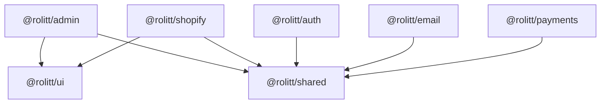

# Task 009: 更新包间依赖关系

> **目标**：更新所有包的 package.json 依赖关系，确保正确的工作区依赖配置

---

## 📋 任务概述

**前置条件**：Task 001-008 已完成
**当前状态**：包间依赖关系可能不完整或不正确
**目标状态**：所有包正确声明依赖关系
**预计时间**：15 分钟
**风险等级**：低

---

## 🎯 执行步骤

### Step 1: 分析包依赖关系

#### 1.1 依赖关系图


#### 1.2 依赖层级
- **第0层（无依赖）**：`@rolitt/ui`, `@rolitt/shared`
- **第1层（依赖第0层）**：`@rolitt/admin`, `@rolitt/auth`, `@rolitt/email`, `@rolitt/payments`, `@rolitt/shopify`

### Step 2: 更新 UI 包依赖

**文件路径**：`packages/ui/package.json`

```json
{
  "name": "@rolitt/ui",
  "version": "0.1.0",
  "private": true,
  "main": "./src/index.ts",
  "types": "./src/index.ts",
  "exports": {
    ".": "./src/index.ts",
    "./components/*": "./src/components/*.tsx",
    "./lib/*": "./src/lib/*.ts"
  },
  "scripts": {
    "build": "tsc --build",
    "dev": "tsc --build --watch",
    "clean": "rm -rf dist *.tsbuildinfo",
    "lint": "eslint src --ext .ts,.tsx",
    "type-check": "tsc --noEmit"
  },
  "dependencies": {
    "@radix-ui/react-slot": "^1.0.2",
    "class-variance-authority": "^0.7.0",
    "clsx": "^2.0.0",
    "lucide-react": "^0.294.0",
    "tailwind-merge": "^2.0.0"
  },
  "devDependencies": {
    "@types/react": "^18.2.37",
    "@types/react-dom": "^18.2.15",
    "typescript": "^5.2.2"
  },
  "peerDependencies": {
    "react": ">=18.0.0",
    "react-dom": ">=18.0.0"
  }
}
```

### Step 3: 更新 Shared 包依赖

**文件路径**：`packages/shared/package.json`

```json
{
  "name": "@rolitt/shared",
  "version": "0.1.0",
  "private": true,
  "main": "./src/index.ts",
  "types": "./src/index.ts",
  "exports": {
    ".": "./src/index.ts",
    "./types": "./src/types/index.ts",
    "./constants": "./src/constants/index.ts",
    "./utils": "./src/utils/index.ts",
    "./hooks": "./src/hooks/index.ts",
    "./contracts": "./src/contracts/index.ts",
    "./schemas": "./src/schemas/index.ts"
  },
  "scripts": {
    "build": "tsc --build",
    "dev": "tsc --build --watch",
    "clean": "rm -rf dist *.tsbuildinfo",
    "lint": "eslint src --ext .ts,.tsx",
    "type-check": "tsc --noEmit"
  },
  "devDependencies": {
    "@types/react": "^18.2.37",
    "@types/react-dom": "^18.2.15",
    "typescript": "^5.2.2"
  },
  "peerDependencies": {
    "react": ">=18.0.0",
    "react-dom": ">=18.0.0"
  }
}
```

### Step 4: 更新 Admin 包依赖

**文件路径**：`packages/admin/package.json`

```json
{
  "name": "@rolitt/admin",
  "version": "0.1.0",
  "private": true,
  "main": "./src/index.ts",
  "types": "./src/index.ts",
  "scripts": {
    "build": "tsc --build",
    "dev": "tsc --build --watch",
    "clean": "rm -rf dist *.tsbuildinfo",
    "lint": "eslint src --ext .ts,.tsx",
    "type-check": "tsc --noEmit"
  },
  "dependencies": {
    "@rolitt/ui": "workspace:*",
    "@rolitt/shared": "workspace:*"
  },
  "devDependencies": {
    "@types/react": "^18.2.37",
    "@types/react-dom": "^18.2.15",
    "typescript": "^5.2.2"
  },
  "peerDependencies": {
    "react": ">=18.0.0",
    "react-dom": ">=18.0.0"
  }
}
```

### Step 5: 更新 Shopify 包依赖

**文件路径**：`packages/shopify/package.json`

```json
{
  "name": "@rolitt/shopify",
  "version": "0.1.0",
  "private": true,
  "main": "./src/index.ts",
  "types": "./src/index.ts",
  "scripts": {
    "build": "tsc --build",
    "dev": "tsc --build --watch",
    "clean": "rm -rf dist *.tsbuildinfo",
    "lint": "eslint src --ext .ts,.tsx",
    "type-check": "tsc --noEmit"
  },
  "dependencies": {
    "@rolitt/ui": "workspace:*",
    "@rolitt/shared": "workspace:*",
    "@shopify/shopify-api": "^8.0.0"
  },
  "devDependencies": {
    "@types/react": "^18.2.37",
    "@types/react-dom": "^18.2.15",
    "typescript": "^5.2.2"
  },
  "peerDependencies": {
    "react": ">=18.0.0",
    "react-dom": ">=18.0.0"
  }
}
```

### Step 6: 更新 Auth 包依赖

**文件路径**：`packages/auth/package.json`

```json
{
  "name": "@rolitt/auth",
  "version": "0.1.0",
  "private": true,
  "main": "./src/index.ts",
  "types": "./src/index.ts",
  "scripts": {
    "build": "tsc --build",
    "dev": "tsc --build --watch",
    "clean": "rm -rf dist *.tsbuildinfo",
    "lint": "eslint src --ext .ts,.tsx",
    "type-check": "tsc --noEmit"
  },
  "dependencies": {
    "@rolitt/shared": "workspace:*",
    "bcryptjs": "^2.4.3",
    "jsonwebtoken": "^9.0.2"
  },
  "devDependencies": {
    "@types/bcryptjs": "^2.4.6",
    "@types/jsonwebtoken": "^9.0.5",
    "@types/node": "^20.0.0",
    "typescript": "^5.2.2"
  }
}
```

### Step 7: 更新 Email 包依赖

**文件路径**：`packages/email/package.json`

```json
{
  "name": "@rolitt/email",
  "version": "0.1.0",
  "private": true,
  "main": "./src/index.ts",
  "types": "./src/index.ts",
  "scripts": {
    "build": "tsc --build",
    "dev": "tsc --build --watch",
    "clean": "rm -rf dist *.tsbuildinfo",
    "lint": "eslint src --ext .ts,.tsx",
    "type-check": "tsc --noEmit"
  },
  "dependencies": {
    "@rolitt/shared": "workspace:*",
    "nodemailer": "^6.9.0",
    "@react-email/components": "^0.0.12",
    "@react-email/render": "^0.0.10"
  },
  "devDependencies": {
    "@types/nodemailer": "^6.4.14",
    "@types/react": "^18.2.37",
    "typescript": "^5.2.2"
  },
  "peerDependencies": {
    "react": ">=18.0.0"
  }
}
```

### Step 8: 更新 Payments 包依赖

**文件路径**：`packages/payments/package.json`

```json
{
  "name": "@rolitt/payments",
  "version": "0.1.0",
  "private": true,
  "main": "./src/index.ts",
  "types": "./src/index.ts",
  "scripts": {
    "build": "tsc --build",
    "dev": "tsc --build --watch",
    "clean": "rm -rf dist *.tsbuildinfo",
    "lint": "eslint src --ext .ts,.tsx",
    "type-check": "tsc --noEmit"
  },
  "dependencies": {
    "@rolitt/shared": "workspace:*",
    "stripe": "^14.0.0"
  },
  "devDependencies": {
    "@types/node": "^20.0.0",
    "typescript": "^5.2.2"
  }
}
```

### Step 9: 更新根 package.json

**文件路径**：`package.json`

```json
{
  "name": "rolitt-monorepo",
  "version": "0.1.0",
  "private": true,
  "workspaces": [
    "packages/*"
  ],
  "scripts": {
    "build": "turbo build",
    "build:packages": "node scripts/build-packages.js",
    "build:tsc": "tsc --build",
    "build:next": "next build",
    "clean": "turbo clean",
    "clean:packages": "node scripts/clean-packages.js",
    "dev": "next dev",
    "dev:turbo": "turbo dev",
    "type-check": "tsc --noEmit --project tsconfig.dev.json",
    "type-check:packages": "tsc --build --dry",
    "type-check:strict": "tsc --noEmit --strict",
    "watch:packages": "tsc --build --watch",
    "validate:paths": "node scripts/validate-paths.js",
    "validate:references": "node scripts/validate-references.js",
    "validate:all": "npm run validate:paths && npm run validate:references",
    "install:packages": "npm install",
    "update:deps": "npm update",
    "audit:packages": "npm audit"
  },
  "dependencies": {
    "@rolitt/admin": "workspace:*",
    "@rolitt/auth": "workspace:*",
    "@rolitt/email": "workspace:*",
    "@rolitt/payments": "workspace:*",
    "@rolitt/shared": "workspace:*",
    "@rolitt/shopify": "workspace:*",
    "@rolitt/ui": "workspace:*",
    "next": "14.0.0",
    "react": "^18.2.0",
    "react-dom": "^18.2.0"
  },
  "devDependencies": {
    "@types/node": "^20.0.0",
    "@types/react": "^18.2.37",
    "@types/react-dom": "^18.2.15",
    "eslint": "^8.0.0",
    "eslint-config-next": "14.0.0",
    "turbo": "^1.10.0",
    "typescript": "^5.2.2"
  },
  "engines": {
    "node": ">=18.0.0",
    "npm": ">=8.0.0"
  }
}
```

### Step 10: 创建依赖验证脚本

**文件路径**：`scripts/validate-dependencies.js`

```javascript
const fs = require('node:fs');
const path = require('node:path');

function validateDependencies() {
  console.log('🔍 验证包依赖关系...');

  const rootPackageJson = JSON.parse(fs.readFileSync('package.json', 'utf8'));
  const workspaces = rootPackageJson.workspaces || [];

  console.log('\n📦 工作区配置:');
  workspaces.forEach((workspace) => {
    console.log(`  ✅ ${workspace}`);
  });

  const packagesDir = './packages';
  const packages = fs.readdirSync(packagesDir);

  console.log('\n🔗 包依赖关系:');

  packages.forEach((pkg) => {
    const packagePath = path.join(packagesDir, pkg);
    const packageJsonPath = path.join(packagePath, 'package.json');

    if (fs.existsSync(packageJsonPath)) {
      const packageJson = JSON.parse(fs.readFileSync(packageJsonPath, 'utf8'));
      const deps = packageJson.dependencies || {};
      const devDeps = packageJson.devDependencies || {};
      const peerDeps = packageJson.peerDependencies || {};

      console.log(`\n  📦 ${pkg}:`);

      // 检查工作区依赖
      const workspaceDeps = Object.entries(deps).filter(([name]) => name.startsWith('@rolitt/'));
      if (workspaceDeps.length > 0) {
        console.log('    工作区依赖:');
        workspaceDeps.forEach(([name, version]) => {
          const isCorrect = version === 'workspace:*';
          const status = isCorrect ? '✅' : '❌';
          console.log(`      ${status} ${name}: ${version}`);
        });
      } else {
        console.log('    工作区依赖: 无');
      }

      // 检查外部依赖
      const externalDeps = Object.entries(deps).filter(([name]) => !name.startsWith('@rolitt/'));
      if (externalDeps.length > 0) {
        console.log('    外部依赖:');
        externalDeps.forEach(([name, version]) => {
          console.log(`      📄 ${name}: ${version}`);
        });
      }

      // 检查 peerDependencies
      if (Object.keys(peerDeps).length > 0) {
        console.log('    对等依赖:');
        Object.entries(peerDeps).forEach(([name, version]) => {
          console.log(`      🤝 ${name}: ${version}`);
        });
      }
    }
  });
}

function checkCircularDependencies() {
  console.log('\n🔄 检查循环依赖...');

  const packagesDir = './packages';
  const packages = fs.readdirSync(packagesDir);
  const dependencyGraph = {};

  // 构建依赖图
  packages.forEach((pkg) => {
    const packageJsonPath = path.join(packagesDir, pkg, 'package.json');

    if (fs.existsSync(packageJsonPath)) {
      const packageJson = JSON.parse(fs.readFileSync(packageJsonPath, 'utf8'));
      const deps = packageJson.dependencies || {};

      dependencyGraph[`@rolitt/${pkg}`] = Object.keys(deps)
        .filter(dep => dep.startsWith('@rolitt/'));
    }
  });

  // 检查循环依赖
  function hasCycle(node, visited = new Set(), recursionStack = new Set()) {
    if (recursionStack.has(node)) {
      return true; // 发现循环
    }

    if (visited.has(node)) {
      return false;
    }

    visited.add(node);
    recursionStack.add(node);

    const dependencies = dependencyGraph[node] || [];
    for (const dep of dependencies) {
      if (hasCycle(dep, visited, recursionStack)) {
        return true;
      }
    }

    recursionStack.delete(node);
    return false;
  }

  let hasCircularDeps = false;
  Object.keys(dependencyGraph).forEach((pkg) => {
    if (hasCycle(pkg)) {
      console.log(`❌ 发现循环依赖: ${pkg}`);
      hasCircularDeps = true;
    }
  });

  if (!hasCircularDeps) {
    console.log('✅ 未发现循环依赖');
  }
}

function validateWorkspaceVersions() {
  console.log('\n📋 验证工作区版本一致性...');

  const packagesDir = './packages';
  const packages = fs.readdirSync(packagesDir);
  const versions = {};

  packages.forEach((pkg) => {
    const packageJsonPath = path.join(packagesDir, pkg, 'package.json');

    if (fs.existsSync(packageJsonPath)) {
      const packageJson = JSON.parse(fs.readFileSync(packageJsonPath, 'utf8'));
      versions[packageJson.name] = packageJson.version;
    }
  });

  console.log('包版本:');
  Object.entries(versions).forEach(([name, version]) => {
    console.log(`  📦 ${name}: ${version}`);
  });
}

if (require.main === module) {
  validateDependencies();
  checkCircularDependencies();
  validateWorkspaceVersions();
}

module.exports = {
  validateDependencies,
  checkCircularDependencies,
  validateWorkspaceVersions
};
```

### Step 11: 更新 package.json 脚本

**添加依赖验证脚本到根 package.json**：

```json
{
  "scripts": {
    "validate:deps": "node scripts/validate-dependencies.js",
    "validate:all": "npm run validate:paths && npm run validate:references && npm run validate:deps"
  }
}
```

---

## ✅ 验收标准

- [ ] 所有包的 package.json 依赖关系正确
- [ ] 工作区依赖使用 `workspace:*` 版本
- [ ] 外部依赖版本合理且一致
- [ ] peerDependencies 正确配置
- [ ] 依赖验证脚本创建完成
- [ ] 执行 `npm install` 成功
- [ ] 执行 `npm run validate:deps` 通过
- [ ] 没有循环依赖
- [ ] 所有包可以正确构建

---

## 🧪 测试验证

```bash
# 清理并重新安装依赖
npm run clean:packages
rm -rf node_modules package-lock.json
npm install

# 验证依赖关系
npm run validate:deps

# 验证构建
npm run build:packages

# 验证类型检查
npm run type-check

# 验证所有配置
npm run validate:all
```

---

## 🔄 回滚方案

```bash
# 恢复原有 package.json 文件
git checkout package.json
git checkout packages/*/package.json

# 删除验证脚本
rm scripts/validate-dependencies.js

# 重新安装依赖
npm install
```

---

## 📝 注意事项

1. **版本一致性**：确保相同依赖在不同包中使用相同版本
2. **工作区协议**：使用 `workspace:*` 引用内部包
3. **对等依赖**：正确配置 peerDependencies 避免重复安装
4. **依赖最小化**：只添加必要的依赖
5. **安全性**：定期运行 `npm audit` 检查安全漏洞

---

## 🚨 常见问题

**Q: 安装依赖时报错 "workspace not found"？**
A: 检查工作区配置和包名是否正确

**Q: 类型检查失败？**
A: 确保所有依赖的类型定义都已安装

**Q: 构建顺序错误？**
A: 检查 TypeScript 项目引用配置

**Q: 依赖版本冲突？**
A: 使用 `npm ls` 检查依赖树，解决版本冲突

---

**🎯 完成此任务后，继续执行 Task 010: 验证构建流程**
