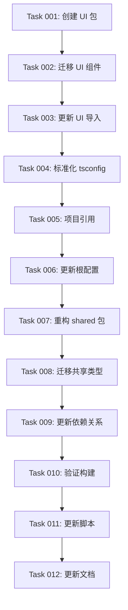

# 📦 包架构重构实施方案

> **目标**：将当前项目重构为符合 monorepo 最佳实践的包架构，实现 `@rolitt/ui`、`@rolitt/shared` 等标准化导入路径

---

## 🎯 重构目标

### 当前问题
- UI 组件散布在 `src/components/ui/` 中，无法被包正确引用
- 各包的 tsconfig.json 配置不一致，导致类型错误
- 缺乏统一的共享组件和工具函数管理
- 路径映射不符合 monorepo 最佳实践

### 期望架构
```
packages/
├── ui/           # 共享 UI 组件 (@rolitt/ui)
├── admin/        # 管理后台 (@rolitt/admin)
├── auth/         # 认证模块 (@rolitt/auth)
├── email/        # 邮件模块 (@rolitt/email)
├── payments/     # 支付模块 (@rolitt/payments)
├── shared/       # 共享类型和常量 (@rolitt/shared)
└── shopify/      # Shopify 集成 (@rolitt/shopify)
```

---

## 📋 实施阶段

### 🚀 第一阶段：创建 UI 包（高优先级）
**目标**：将 `src/components/ui/` 迁移到独立的 `@rolitt/ui` 包

- [ ] **Task 001**：创建 `packages/ui` 包结构 → `/tasks/001-create-ui-package.md`
- [ ] **Task 002**：迁移 UI 组件到 UI 包 → `/tasks/002-migrate-ui-components.md`
- [ ] **Task 003**：更新 UI 包的导入路径 → `/tasks/003-update-ui-imports.md`

### 🔧 第二阶段：标准化包配置（中优先级）
**目标**：统一所有包的 TypeScript 配置和项目引用

- [ ] **Task 004**：创建标准化 tsconfig 模板 → `/tasks/004-standardize-tsconfig.md`
- [ ] **Task 005**：配置 TypeScript 项目引用 → `/tasks/005-setup-project-references.md`
- [ ] **Task 006**：更新根 tsconfig.json 路径映射 → `/tasks/006-update-root-tsconfig.md`

### 🎨 第三阶段：优化共享包（中优先级）
**目标**：重构 `@rolitt/shared` 包，提供更好的类型和工具支持

- [ ] **Task 007**：重构 shared 包结构 → `/tasks/007-refactor-shared-package.md`
- [ ] **Task 008**：迁移共享类型定义 → `/tasks/008-migrate-shared-types.md`
- [ ] **Task 009**：更新包间依赖关系 → `/tasks/009-update-package-dependencies.md`

### ✅ 第四阶段：验证和测试（高优先级）
**目标**：确保重构后的架构稳定可靠

- [ ] **Task 010**：验证构建流程 → `/tasks/010-verify-build-process.md`
- [ ] **Task 011**：更新开发脚本 → `/tasks/011-update-dev-scripts.md`
- [ ] **Task 012**：文档更新和清理 → `/tasks/012-update-documentation.md`

---

## 🔗 依赖关系



---

## ⚡ 执行策略

### 🎯 One-Shot 执行原则
- 每个 Task 控制在 5-8 个步骤内
- 单次执行时间 10-20 分钟
- 每个 Task 有明确的验收标准
- 支持独立回滚和测试

### 🛡️ 风险控制
- **渐进式迁移**：保持现有功能正常运行
- **向后兼容**：暂时保留旧的导入路径
- **分支保护**：在功能分支上执行，测试通过后合并
- **回滚机制**：每个阶段完成后创建检查点

### 📊 验收标准
- [ ] `npm run build` 成功执行
- [ ] 所有 TypeScript 类型检查通过
- [ ] 现有功能保持正常
- [ ] 新的导入路径正常工作
- [ ] 开发服务器正常启动

---

## 🚀 立即开始

**推荐执行顺序**：
1. 先执行 Task 001-003（UI 包创建和迁移）
2. 验证 UI 包功能正常后，继续 Task 004-006
3. 最后执行 Task 007-012 完成整体优化

**执行命令示例**：
```bash
# 基于任务文件执行
@tasks/001-create-ui-package.md
Based on this task file, complete the UI package creation in one shot.
```

---

## 📚 相关资源

- [CLAUDE_CODE_DEVELOPMENT_GUIDE.md](../docs/CLAUDE_CODE_DEVELOPMENT_GUIDE.md)
- [TypeScript Project References](https://www.typescriptlang.org/docs/handbook/project-references.html)
- [Monorepo 最佳实践](https://nx.dev/blog/managing-ts-packages-in-monorepos)
- [saasfly 项目参考](https://github.com/nextify-limited/saasfly)

---

**🎯 记住：稳定性优先，渐进式重构，每个步骤都要有明确的验收标准！**
